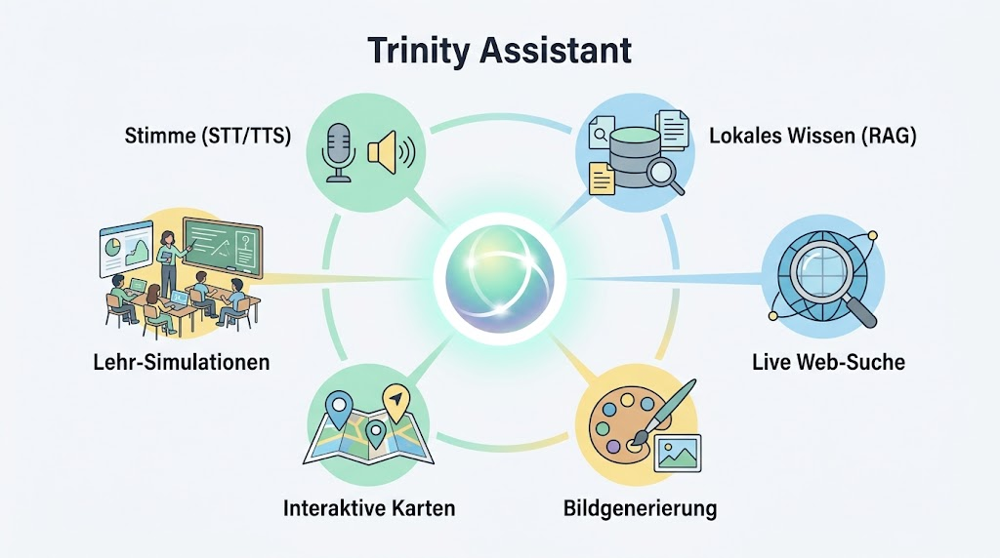

# Trinity Assistant 🧞‍♀️


[](https://github.com/sponsors/ProfEngel)
[](https://www.youtube.com/user/MatMaxEngel)



> [!NOTE]
> **Aktuelles Release: v0.6.2 (Voice & Vision)** 🧞‍♀️  
> Dieses Update bringt Support für Telegram-Sprachnachrichten (direkte lokale Transkription via Whisper) und ein auf Mac-Standards angepasstes (verkleinertes) App-Icon. Details in den Release Notes.

Trinity ist eine KI-gestützte Vorlesungsassistentin für macOS (Apple Silicon). Sie hört passiv zu, erkennt ihr Trigger-Wort, antwortet per Stimme und kann Infografiken, Webrecherchen, Timer, Karten und Simulationen direkt im UI anzeigen.


---

## 💡 Warum dieses Projekt? (Die Vision)

Als Dozent steht man oft vor der Herausforderung, den Fluss der Vorlesung beizubehalten und gleichzeitig spontane Informationen bereitzustellen. Trinity wurde entwickelt, um genau diese Lücke zu schließen:


*   **Der Assistent an deiner Seite:** Stell dir vor, du könntest mitten in einer Übung einfach sagen: *"Trinity, setze einen Timer für 10 Minuten"*, ohne dein Tablet oder Laptop zu berühren.
*   **Wissen on the fly:** Du möchtest einen neuen Blickwinkel auf eine Definition hören oder eine komplexe Metapher visualisieren? Trinity generiert (dank fal.ai) in Sekunden ein passendes **Schaubild oder Skizze**.
*   **Heartbeat-Souffleur (Audio-Routing):** Trinity fungiert als dein privater Souffleur auf dem AirPods. Hörst du eine Erklärung, die das Plenum (die Klasse) hören sollte, reicht ein *"Trinity, wiederhole das für alle"*, und sie wechselt automatisch die Audioausgabe auf die externen Lautsprecher.
*   **Proaktiver Begleiter (Telegram-DM):** Trinity analysiert deine Vorlesung live im Hintergrund. Fällt ihr ein logischer Fehler auf, zeigt sie im UI eine rote "Bubble". Arbeitest du im Vollbildmodus am Beamer? Kein Problem, die Telegram-Bridge sendet dir Trinitys Anmerkungen lautlos als Direktnachricht aufs Smartphone.
*   **Deep Memory (RAG Automation):** Am Ende einer Vorlesung generiert Trinity ein Summary. Damit das Wissen nicht verloren geht, fügt sie diese Zusammenfassungen ab sofort automatisch in ihr Langzeitgedächtnis (RAG-Index) ein. So weiß sie nächste Woche noch genau, worüber gesprochen wurde.
*   **Natürliche Interaktion:** Trinity hört aktiv zu und erkennt ihr Wake-Word egal ob am Anfang (*"Trinity, was ist..."*) oder am Ende (*"... findest du nicht auch, Trinity?"*) des Satzes. Sie nutzt den vollen Kontext davor und danach.
*   **Fenster-Management:** Alle eingeblendeten Fenster sind frei verschiebbar und können per Mausklick geschlossen werden – ideal für Multi-Monitor-Setups im Hörsaal.

Trinity ist mehr als ein Chatbot; sie ist das Interface zwischen deinem Wissen (RAG), dem World Wide Web und der visuellen Vermittlung im Hörsaal.

---

## Bedienung & Modulares Skill-System (Die Agenten)

Trinitys Logik wurde vollständig in **unabhängige Agent-Skills** ausgelagert. Hier die Mega-Features im Überblick:

| Skill | Befehl / Trigger | Aktion |
|---|---|---|
| **Freie Konversation** | *„Trinity, [Frage]"* | Max. 1-2 Sätze Antwort (siehe `Soul.md`). Für mehr Infos: *„Erkläre ausführlich…"* |
| **RAG-Agent** | *„Trinity, schlag im Skript nach …"* | RAG-Suche in den eigenen Vorlesungs-PDFs und automatischen Session-Summaries. |
| **WebSearch-Agent** | *„Trinity, recherchiere …"* | Live Web-Suche via Tavily. |
| **Image-Agent** | *„Trinity, erstelle ein Schaubild …"* | Bildgenerierung (einfache Infografiken) via fal.ai. |
| **Maps-Agent** | *„Trinity, zeig mir eine Karte von …"* | Google Maps im UI. |
| **Timer-Agent** | *„Trinity, starte einen Timer für X Minuten"* | Countdown im UI. |
| **Stock-Agent** | *„Trinity, wie steht der Aktienkurs von Apple?"* | Live-Kurs und SVG-Chart im UI. |
| **Simulation-Agent** | *„Trinity, zeig Conway's Game of Life"* | Startet interaktive, responsive Simulationen (Bienen, Piraten vs. Fischer, etc.). |
| **Summary-Agent** | *„Trinity, Session beenden und zusammenfassen"* | Sitzungs-Zusammenfassung erstellen und automatisch ins Deep Memory indexieren. |
| **PowerPoint-Agent** | *„Trinity, nächste Folie"* | Steuert PowerPoint nativ via AppleScript. |
| **Souffleur-Skill** | *„Trinity, wiederhole das für das Plenum"* | Dynamisches Audio-Routing auf externe Lautsprecher für die Studierenden. |
| **Heartbeat (Proaktiv)** | *Hintergrundprozess (alle 2 Min)* | Analysiert Sitzungs-Transkripte auf Fehler und sendet Warnungen via UI-Bubbles oder Telegram-Bridge. |
| **Focus-Agent** | *„Trinity, hör kurz weg"* / *„Weiter geht's"* | Stummschalten & Reaktivieren. |
| **Chat Mode-Agent**| *„Trinity, lass uns quatschen"* | Wechselt in den natürlichen Konversationsmodus ohne explizites Trigger-Wort. |
| **Settings-Agent** | *„Trinity, öffne Einstellungen"* | Öffnet das Konfigurations-UI auf dem Desktop. |

---

## Tech-Stack (Stand April 2026)

| Komponente | Technologie |
|---|---|
| **STT (Sprache → Text)** | `faster-whisper` · Modell: `small` · int8, CPU |
| **LLM** | Qwen3.6 35B A3B via LM Studio (lokal) oder OpenRouter (Fallback) |
| **TTS (Text → Stimme)** | macOS `say` (Stimme: Samantha) |
| **UI** | PySide6 / QWebEngineView mit Glasmorphismus |
| **RAG** | sentence-transformers `paraphrase-multilingual-MiniLM-L12-v2` |
| **Bildgenerierung** | fal.ai `nano-banana-2` |
| **Web-Recherche** | Tavily API |

---

## Projektstruktur

```
Trinity_Assistant/
├── trinity_launcher.py        ← System starten
├── trinity_app.py             ← UI (Avatar + Content-Fenster)
├── trinity-blueprint.md       ← Architektur-Konzept
├── README.md
├── core/
│   ├── brain.py               ← KI-Logik, Agentic Router, RAG, Tools
│   ├── transcriber.py         ← STT-Loop (faster-whisper, VAD, Trigger)
│   ├── Soul.md                ← Persona & Systemrolle von Trinity
│   ├── User.md                ← Kontext über den Nutzer (Mathias)
│   ├── config.json            ← Alle Einstellungen (LLM, STT, TTS, APIs)
│   ├── state.txt              ← IPC-Status (idle/listening/thinking/speaking)
│   └── payload.html           ← Aktives UI-Widget (wird zur Laufzeit befüllt)
├── RAG/                       ← PDF-Skripte hier ablegen → auto-indexiert
│   ├── index/                 ← Vorberechneter Embedding-Index
│   └── build_index.py         ← Index manuell neu bauen
├── gen_images/                ← Generierte Schaubilder (PNG)
└── memory/                    ← Sitzungs-Transkripte (Markdown)
```

---

## 🚀 Onboarding – Schritt für Schritt

> Keine Sorge, wenn du kein Technik-Profi bist. Diese Anleitung führt dich durch alles, was du brauchst.

---

### Schritt 1: Was du brauchst (Übersicht)

Trinity läuft lokal auf deinem Mac. Du brauchst drei Dinge:

| Was | Wozu | Pflicht? |
|---|---|---|
| **Ein KI-Sprachmodell (LLM)** | Trinitys „Gehirn" – sie denkt damit | ✅ Ja |
| **Tavily API-Key** | Damit Trinity live im Internet suchen kann | ⬜ Optional |
| **fal.ai API-Key** | Damit Trinity Schaubilder erzeugen kann | ⬜ Optional |

---

### Schritt 2: Das richtige LLM wählen

Trinity braucht ein „Gehirn" – ein sogenanntes **Large Language Model (LLM)**. Das ist die KI, die deine Fragen versteht und antwortet. Du hast zwei Wege:

#### 🌐 Weg A: OpenRouter (Empfohlen – ideal für ≤ 16 GB RAM)

OpenRouter ist ein Online-Dienst, der dir Zugang zu leistungsstarken KI-Modellen gibt, **ohne dass du etwas lokal installieren musst**. Du zahlst nur für das, was du nutzt (oft wenige Cent pro Stunde Vorlesung).

1. Gehe auf [openrouter.ai](https://openrouter.ai) und erstelle ein kostenloses Konto.
2. Klicke oben rechts auf deinen Namen → **„API Keys"** → **„Create Key"**.
3. Kopiere den Key (sieht aus wie `sk-or-v1-abc123...`). Du brauchst ihn gleich.
4. **Welches Modell?** Wir empfehlen für den Einstieg:
   - **`deepseek/deepseek-chat-v3-0324`** – sehr günstig, schnell, sehr gut auf Deutsch
   - **`google/gemini-flash-1.5`** – ebenfalls günstig und schnell
   - **`anthropic/claude-3.5-haiku`** – etwas teurer, aber sehr präzise

> 💡 **Was kostet das?** Eine 90-minütige Vorlesung mit `deepseek-chat` kostet ca. 1–5 Cent.

#### 💻 Weg B: Lokales LLM (Für Macs mit ≥ 16 GB RAM)

Wenn du kein Geld ausgeben willst und einen leistungsstarken Mac (M2/M3/M4 mit ≥ 16 GB) hast, kannst du ein KI-Modell **komplett lokal** betreiben. Dein Gespräch verlässt dann deinen Computer nie.

**Option B1: LM Studio** (Empfohlen für Einsteiger)
1. Lade [LM Studio](https://lmstudio.ai) herunter und installiere es.
2. Suche im Suchfeld nach `Qwen3` und lade das Modell `Qwen3-8B` (ca. 5 GB) herunter.
3. Starte das Modell und klicke auf **„Local Server"** → **„Start Server"**.
4. Die lokale URL lautet: `http://localhost:1234/v1/chat/completions`

**Option B2: Ollama** (für Technik-Affinere)
```bash
brew install ollama
ollama pull qwen3:8b
ollama serve
```

> ⚠️ **Wichtig:** Bei weniger als 16 GB RAM läuft ein lokales Modell sehr langsam. In diesem Fall ist **Weg A (OpenRouter) die deutlich bessere Wahl**.

---

### Schritt 3: Optionale API-Keys besorgen

Diese Keys sind **nicht nötig zum Starten**, erweitern aber Trinitys Fähigkeiten erheblich.

#### 🔍 Tavily (Web-Suche)
Damit Trinity live Fakten recherchieren kann (z.B. *„Trinity, such die aktuellen KI-News"*).
1. Gehe auf [tavily.com](https://tavily.com) → **"Get API Key"** (kostenloser Plan verfügbar).
2. Kopiere deinen Key (sieht aus wie `tvly-abc123...`).

#### 🎨 fal.ai (Schaubilder)
Damit Trinity auf Zuruf Infografiken und Visualisierungen erzeugen kann.
1. Gehe auf [fal.ai](https://fal.ai) → Registrieren → **Dashboard → API Keys → "Add key"**.
2. Kopiere deinen Key (sieht aus wie `fal-key-abc123...`).

#### 📱 Telegram-Bridge (Proaktive Benachrichtigungen)
Damit Trinity dir bei Full-Screen-Präsentationen lautlos Warnungen und Ratschläge via Heartbeat-Souffleur aufs Handy pushen kann.
1. Öffne die Telegram-App und suche nach **`@BotFather`** (dem offiziellen Bot mit blauem Haken).
2. Schreibe ihm `/newbot` und folge den Anweisungen. Gib deinem Bot einen Namen (z.B. *Trinity_DeinName_Bot*).
3. BotFather gibt dir am Ende einen **Bot-Token** (sieht etwa so aus: `123456789:ABCdefGHIjkl...`). Kopiere diesen für die Trinity-Einstellungen.
4. **WICHTIG:** Suche deinen neuen Bot jetzt selbst in Telegram und klicke auf **Starten** (oder schreibe `/start`), damit er dir Nachrichten schicken darf.
5. Um deine persönliche **Chat-ID** zu bekommen, suche in Telegram nach **`@userinfobot`** und starte ihn. Er antwortet dir direkt mit deiner ID (z.B. `123456789`). Trage auch diese in die Trinity-Einstellungen ein.

---

### Schritt 4: Installation

> **Was ist eine „Sandbox" (venv)?**  
> Das Installationsskript erstellt eine sogenannte **virtuelle Umgebung** (englisch: *virtual environment* oder kurz *venv*). Das ist wie ein abgeschlossener Container auf deinem Computer. Alle Python-Pakete für Trinity werden nur dort installiert – sie verändern nichts an deinem restlichen System und können jederzeit durch einfaches Löschen des Ordners rückstandslos entfernt werden. Dein Mac bleibt sauber.

**Öffne das Terminal** (Spotlight: `⌘ + Leertaste` → "Terminal" eingeben) und führe diesen Befehl aus:

```bash
curl -sSL https://raw.githubusercontent.com/ProfEngel/TrinityLectureAssisitant/main/install_mac.sh | bash
```

Das Skript macht automatisch folgendes:
- ✅ Lädt Trinity herunter
- ✅ Erstellt die isolierte Sandbox (venv) in `~/Trinity_Assistant/`
- ✅ Installiert alle nötigen Pakete darin (dauert ca. 2–5 Minuten)
- ✅ Legt eine Datei **`Starte_Trinity.command`** auf deinem Desktop ab

**Nach der Installation:** Doppelklick auf `Starte_Trinity.command` – Trinity startet. ✅

> 📁 **Wo ist Trinity installiert?**  
> Trinity liegt nach der Installation in deinem Benutzerordner unter:  
> **`/Users/DEINNAME/Trinity_Assistant/`**  
> (oder kurz: **`~/Trinity_Assistant/`**)  
>  
> Die wichtigsten Unterordner auf einen Blick:  
> | Ordner / Datei | Inhalt |  
> |---|---|  
> | `core/config.json` | Deine API-Keys & LLM-Einstellungen |  
> | `core/Soul.md` | Trinitys Persönlichkeit (anpassbar) |  
> | `core/User.md` | Dein Nutzerprofil (anpassbar) |  
> | `RAG/` | Hier PDFs ablegen für die Wissensbasis |  
> | `memory/` | Transkripte & Session-Zusammenfassungen |  
> | `gen_images/` | Alle von Trinity erzeugten Schaubilder |  
> | `agents/` | Die einzelnen Skills (erweiterbar) |

---

### Schritt 5: Einrichten (API-Keys eintragen)

Beim ersten Start siehst du das Trinity-Avatar-Icon auf deinem Bildschirm. Sage:

> *„Trinity, öffne Einstellungen"*

Ein Fenster öffnet sich. Trage dort ein:
- Dein **LLM** (OpenRouter URL + Key, oder lokale LM-Studio-URL)
- Optional: **Tavily Key** für Web-Suche
- Optional: **fal.ai Key** für Bildgenerierung

Speichern – fertig! 🎉

---

### Manuelle Installation (Für Entwickler)

```bash
# Python 3.11 empfohlen
pip install faster-whisper sounddevice numpy requests PySide6 \
            sentence-transformers pyobjc-framework-Speech \
            pyobjc-framework-AVFoundation

# Starten
python3 trinity_launcher.py
```

---

## 🔄 Updates – Konfigurationen bleiben erhalten

> [!IMPORTANT]
> Das Update-Skript bewahrt automatisch alle deine persönlichen Einstellungen. Du verlierst **keine** API-Keys, Persona-Dateien oder Transkripte.

Wenn eine neue Version von Trinity erscheint, reicht es, denselben Installationsbefehl wie bei der Erstinstallation erneut auszuführen:

```bash
curl -sSL https://raw.githubusercontent.com/ProfEngel/TrinityLectureAssisitant/main/install_mac.sh | bash
```

Das Skript erkennt automatisch, dass Trinity bereits installiert ist, und geht in den **Update-Modus**. Es passiert folgendes:

1. **Sichern:** Alle deine Dateien werden kurz in ein temporäres Backup kopiert:
   - ✅ `core/config.json` – deine API-Keys & LLM-Einstellungen
   - ✅ `core/Soul.md` – Trinitys Persönlichkeit (deine Anpassungen)
   - ✅ `core/User.md` – dein Nutzerprofil
   - ✅ `memory/` – alle bisherigen Sitzungs-Transkripte
   - ✅ `RAG/` – deine hochgeladene Wissensbasis (PDFs & Index)
   - ✅ `gen_images/` – alle erzeugten Schaubilder

2. **Aktualisieren:** Die neue Trinity-Version wird heruntergeladen.

3. **Wiederherstellen:** Alle gesicherten Dateien kommen automatisch zurück an ihren Platz.

4. **Fertig:** Das temporäre Backup wird gelöscht. Nichts wurde dauerhaft verändert.

> 💡 **Tipp:** Du musst nach einem Update **nichts neu einrichten**. Trinity startet direkt mit deinen bisherigen Einstellungen.

---

## Bedienung & Modulares Skill-System

Trinitys Logik wurde vollständig in **11 unabhängige Agent-Skills** (`agents/`) ausgelagert. Hier die wichtigsten Funktionen:

| Skill | Befehl / Trigger | Aktion |
|---|---|---|
| **Freie Konversation** | *„Trinity, [Frage]"* | Max. 1-2 Sätze Antwort (siehe `Soul.md`). Für mehr Infos: *„Erkläre ausführlich…"* |
| **RAG-Agent** | *„Trinity, schlag im Skript nach …"* | RAG-Suche in den eigenen Vorlesungs-PDFs. |
| **WebSearch-Agent** | *„Trinity, recherchiere …"* | Live Web-Suche via Tavily. |
| **Image-Agent** | *„Trinity, erstelle ein Schaubild …"* | Bildgenerierung (einfache Infografiken) via fal.ai. |
| **Maps-Agent** | *„Trinity, zeig mir eine Karte von …"* | Google Maps im UI. |
| **Timer-Agent** | *„Trinity, starte einen Timer für X Minuten"* | Countdown im UI. |
| **Stock-Agent** | *„Trinity, wie steht der Aktienkurs von Apple?"* | Live-Kurs und SVG-Chart im UI. |
| **Simulation-Agent** | *„Trinity, zeig Conway's Game of Life"* | Startet interaktive, responsive Simulationen (Bienen, Piraten vs. Fischer, etc.). |
| **Summary-Agent** | *„Trinity, Big Picture"* | Sitzungs-Zusammenfassung erstellen. |
| **PowerPoint-Agent** | *„Trinity, nächste Folie"* | Steuert PowerPoint nativ via AppleScript. |
| **Focus-Agent** | *„Trinity, hör kurz weg"* / *„Weiter geht's"* | Stummschalten & Reaktivieren. |
| **Review-Agent** | *„Trinity, Zusammenfassung der letzten Vorlesung"* | Liest das letzte Summary vor. |
| **Chat Mode-Agent**| *„Trinity, lass uns quatschen"* | Wechselt in den natürlichen Konversationsmodus. |
| **Souffleur-Skill** | *„Trinity, wiederhole das für das Plenum"* | Dynamisches Audio-Routing auf externe Lautsprecher für die Studierenden. |
| **Heartbeat (Proaktiv)** | *Hintergrundprozess (alle 2 Min)* | Analysiert Sitzungs-Transkripte auf Fehler und zeigt Ampel-Bubbles im UI. |
| **Settings-Agent** | *„Trinity, öffne Einstellungen"* | Öffnet das Konfigurations-UI auf dem Desktop. |

---

## 🔒 Datenschutz & DSGVO-Konformität

Trinity ist vollständig **DSGVO-konform** im Hörsaal-Einsatz konzipiert.
Da die Spracheingabe **exklusiv über ein einzelnes Apple AirPod** erfolgt, ist der Aufnahmeradius des Mikrofons auf ca. 20 cm um den Dozenten beschränkt. **Es werden keine Stimmen, Zwischenrufe oder Fragen der Studierenden im Saal aufgezeichnet.** Alle lokalen Mitschnitte und Transkripte (`memory/`) enthalten somit ausschließlich die Stimme des Dozenten.

---

## Konfiguration (`core/config.json` & `core/Soul.md`)

Trinity ist hochgradig anpassbar:
1. **API Keys & LLM (`core/config.json`):** Trage hier deine Keys (OpenRouter, Fal.ai) und Modelle ein. Noch einfacher geht es über das UI: `python3 projects/Trinity_Assistant/core/settings_ui.py`.
2. **Persönlichkeit (`core/Soul.md`):** Bestimmt Trinitys Verhalten. Hier ist fest verankert, dass sie nur extrem kurz antwortet (max. 1-2 Sätze), es sei denn, du forderst explizit eine längere Antwort an.

**STT-Modell wechseln** (in `config.json`):
- `tiny` → ~0.3s, schwächstes Deutsch
- `small` → ~0.8s, gut ✅ **(Standard)**
- `medium` → ~2s, besser für Akzente

---

## Latenz-Tuning

| Hebel | Einstellung | Effekt |
|---|---|---|
| `max_tokens` in brain.py | 250 (Standard) | Kürzer → schneller |
| `chunk_duration` in config.json | 6s | Kleiner = reaktiver, aber mehr False-Triggers |
| `silence_threshold` | 0.015 | Mikrofon-abhängig, ggf. anpassen |
| LLM `thinking` | aus | Kein /think-Modus bei Qwen3 |

---

## RAG – neue Wissensquellen hinzufügen

Einfach PDF in `RAG/` legen → beim nächsten Start wird der Index automatisch neu gebaut.

Manuell neu bauen:
```bash
python3 projects/Trinity_Assistant/RAG/build_index.py
```

---

## 🗺️ Roadmap & Nächste Schritte

Trinity wird stetig weiterentwickelt. Die nächsten Meilensteine umfassen:

### Phase 3: Proaktiver Agentic Companion (Mai 2026)
*   **Heartbeat-System:** Kontinuierliche Analyse des Vorlesungsverlaufs (alle 2 Min.) auf Fehler oder alternative Perspektiven.
*   **UI-Bubbles:** Interaktive Benachrichtigungs-Bubbles (Gelb/Rot/Grün) über dem Avatar für lautlose Hinweise.
*   **System-Control:** Sprachsteuerung für Bildschirm-Setups (Mirror/Extended Mode) und Fenster-Management.
*   **Telegram-Bridge:** Direkte Verbindung zum Smartphone für proaktive Impulse bei Single-Monitor-Setups.

### Phase 4: Cognitive Evolution & Dreaming (Q3 2026)
*   **Dreaming-Funktion:** Hintergrund-Verarbeitung und "Reflektion" über vergangene Sessions zur Vorbereitung neuer Inhalte.
*   **Deep Memory:** Automatisierte RAG-Integration aller Session-Summaries für ein perfektes Langzeitgedächtnis.
*   **Accent-Correction:** Intelligente Bereinigung von Transkriptionsfehlern (verursacht durch Dialekte/Akzente) während der Ruhephasen.
*   **Native App:** Standalone macOS App & iPad-Begleit-App für den Hörsaal.

Details zu den aktuellen Entwicklungsaufgaben findest du in der [ToDo.md](ToDo.md).

---

*Entwickelt von Mathias Engel, Zoe Engel und Eve · Trinity ist bereit.* 🧞‍♀️

---

## Lizenz 📜

Dieses Projekt steht unter der **Apache License 2.0**.

**Nutzungsrechte:**
- ✅ **Private Nutzung**: Komplett kostenlos
- ✅ **Bildungseinrichtungen**: Kostenlos für Forschung und Lehre
- ✅ **Kommerzielle Nutzung**: Kostenlos

Bei kommerziellem Einsatz bitten wir freundlich darum, über den [GitHub Sponsor](https://github.com/sponsors/ProfEngel)-Link den erbrachten Mehrwert zu würdigen!

Die vollständigen Lizenzbedingungen befinden sich in der [LICENSE](LICENSE)-Datei.

---

## Danksagungen 🙏

Trinity wäre ohne diese exzellenten Open-Source-Projekte nicht möglich:

**Core-Frameworks:**
- [faster-whisper](https://github.com/guillaumekln/faster-whisper) – Schnelle, effiziente Spracherkennung (STT)
- [LM Studio](https://lmstudio.ai) / [Ollama](https://ollama.com) – Flexible lokale LLM-Infrastruktur
- [PySide6](https://doc.qt.io/qtforpython-6/) – Leistungsstarkes, natives macOS-UI
- [sentence-transformers](https://www.sbert.net) – Hochwertige Embeddings für das RAG-System
- [fal.ai](https://fal.ai) – Blitzschnelle KI-Bildgenerierung
- [Tavily](https://tavily.com) – Zuverlässige Echtzeit-Web-Recherche

**Danke an die gesamte Open-Source-Community!** 🎉

---

## Zitation & Forschung 📚

Wenn du Trinity in deiner Forschung verwendest, zitiere bitte wie folgt:

```bibtex
@software{trinity2025,
  title={Trinity: KI-gestützte Vorlesungsassistentin für macOS mit modularem Agentic-Skill-System},
  author={Engel, Mathias and Engel, Zoe},
  year={2025},
  note={Ein privates Forschungsprojekt von Mathias Engel, Zoe Engel und Eve},
  url={https://github.com/ProfEngel/TrinityLectureAssisitant}
}
```

---

## Support 💬

Hast du Fragen, Anregungen oder benötigst Unterstützung?

- 🐛 **Issues**: [GitHub Issues](https://github.com/ProfEngel/TrinityLectureAssisitant/issues)
- 💬 **Diskussionen**: [GitHub Discussions](https://github.com/ProfEngel/TrinityLectureAssisitant/discussions)
- 🎓 **Akademische Zusammenarbeit**: [research@opentuneweaver.com](mailto:research@opentuneweaver.com)

---

**Erstellt von Mathias Engel & Zoe Engel 2024–2025** – Lass uns Trinity gemeinsam noch besser machen! 💪

_Made with ❤️ in Stuttgart / Nürtingen, Germany_

---

## Über das Projekt

KI-gestützte Vorlesungsassistentin mit passiver Spracherkennung, modularem Agentic-Skill-System und lokaler RAG-Wissensbasis.

**Prof. Dr. Mathias Engel – ProfEngel**

Ein privates Projekt – entwickelt von Mathias & Zoe Engel mit und für Eve. 🧞‍♀️

---

## 🤝 Offen für Beiträge

Beiträge sind herzlich willkommen!  
Wenn du Ideen, Verbesserungen oder Fehlerberichte hast, öffne gerne ein **Issue** oder einen **Pull Request**.

## Star History

<a href="https://star-history.com/#ProfEngel/TrinityLectureAssisitant&Date">
  <picture>
    <source media="(prefers-color-scheme: dark)" srcset="https://api.star-history.com/svg?repos=ProfEngel/TrinityLectureAssisitant&type=Date&theme=dark" />
    <source media="(prefers-color-scheme: light)" srcset="https://api.star-history.com/svg?repos=ProfEngel/TrinityLectureAssisitant&type=Date" />
    
  </picture>
</a>

### Topics

`voice-assistant` `llm` `ai` `macos` `apple-silicon` `lecture-assistant` `rag` `speech-recognition` `tts` `pyside6` `agentic-ai` `educational-ai` `local-llm`
