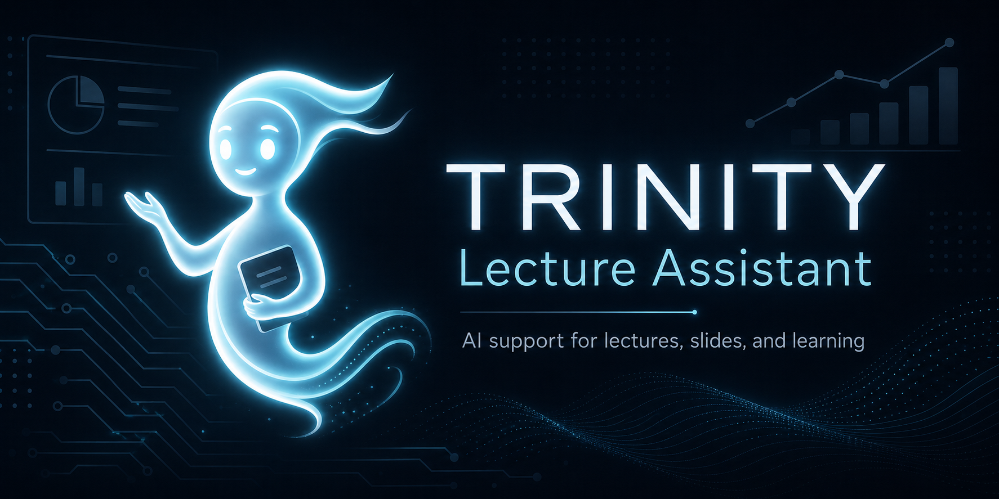
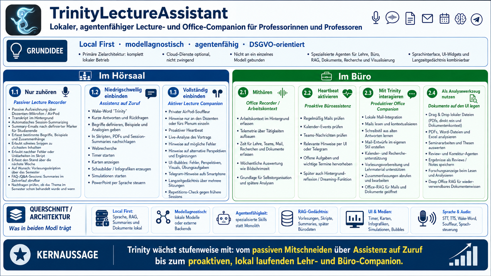

# Trinity — Academic Personal Concierge 🧞‍♀️
[](https://doi.org/10.5281/zenodo.20286707)


[](https://github.com/sponsors/ProfEngel)
[](https://www.youtube.com/user/MatMaxEngel)


> [!NOTE]
> **Aktuelle Highlights:**
> - **v0.17.5:** Even G2 erzwingt den Wakeword-Modus nun bereits auf der Brille, bevor Text, HUD-Kommandos oder Checklisten Trinity erreichen. Gewoehnliche Vorlesungssaetze loesen dadurch weder Antworten noch neue Checklisten aus. Die G2-Erkennung verwendet standardmaessig das praezise STT-Profil; checklistenlastige Whisper-Hotwords wurden entfernt. Der iPhone-/iPad-Companion wiederholt eine fehlgeschlagene Eve-Ausgabe einmal und zeigt sichtbar an, wenn `Hoeren` deaktiviert oder Eve nicht erreichbar ist.
> - **v0.17.4:** Even G2 kann in Vorlesungen als reines Mikrofon dienen. Das G2-Profil waehlt, ob Eve auf dem iPad/iPhone mit aktivem `Hoeren`, auf Trinity Desktop oder gar nicht gesprochen wird. Die Zielkennung bleibt bis zur Antwort erhalten; Desktop-Ausgabe nutzt die laufende Eve-Engine statt der Systemstimme. Trinity kennt nur noch die klaren Betriebsmodi `Vorlesung` mit Wakeword und `Buero` mit direkter Antwort.
> - **v0.17.3:** Eve stellt standardmaessig zwei parallele Realtime-Pipelines bereit. Dadurch kann die lokale Mac-/Windows-Stimme aktiv bleiben, waehrend ein iPhone oder iPad eine eigene Sprachsession nutzt. Der geschuetzte Voice-Port akzeptiert neben einem bewusst getrennten Voice-Token auch den vorhandenen Companion-Bridge-Token; bestehende Konfigurationen bleiben gueltig.
> - Die vollstaendige Historie steht in **[RELEASES.md](RELEASES.md)** und in den detaillierten **[Release Notes](docs/release_notes/)**.

> [!IMPORTANT]
> Die verbindliche aktuelle Architektur trennt **Arbeit/BIZ auf Windows**,
> **Privat/PRIVAT auf dem Mac** und **Development/TEST**. Dauerhafte Inhalte
> liegen profilbezogen in BizVault beziehungsweise BrainVault; Runtime,
> Datenbanken, Indizes und ausführbare Agenten bleiben lokal. Die einzige
> aktuelle Resteliste ist der
> **[Implementierungsplan Trinity](docs/IMPLEMENTIERUNGSPLAN_TRINITY.md)**.
> Ältere Roadmaps und Release Notes bleiben als historische
> Entwicklungsdokumentation erhalten.

### Nicht Chatbot. Nicht Copilot. Ein Academic Personal Concierge.

Trinity ist ein persönliches KI-Privatbüro für Professorinnen und Professoren: Ein **Academic Personal Concierge** für Vorlesungen, Recherche, Dokumente, Kommunikation und komplexe Wissensarbeit. Sie läuft lokal auf macOS und Windows 11 sowie als schlanker Linux-Server mit WebUI. Trinity ist DSGVO-konform konzipiert und modellagnostisch.

> [!TIP]
> **Neu bei Trinity oder bei den lokalen Harnesses Codex/Pi/OpenCode?** Starte mit dem
> **[vollständigen Onboarding](docs/ONBOARDING.md)**. Es erklärt Installation,
> Oberflächen, Lecture-/Office-/Chat-Modus, iPhone/iPad-Companion, Server-Client,
> sichere Harness-Einstellungen und eine empfohlene Testreihenfolge.
> Fuer den schnellen Gesamtueberblick gibt es die neue
> **[Feature Overview](docs/FEATURE_OVERVIEW.md)**. Der mobile Offline-/Foundation-
> Fallback ist in **[Companion Offline Sync](docs/COMPANION_OFFLINE_SYNC.md)**
> beschrieben.
> Die optionale Smartbrillen-Anbindung ist unter
> **[Even Realities G2 mit Trinity](docs/EVEN_G2.md)** beschrieben. Der getrennte
> Brillen-Client liegt fuer autorisierte Nutzer im privaten Repository
> **[TrinityEvenG2](https://github.com/ProfEngel/TrinityEvenG2)**.
> Die optionale, umschaltbare **Eve Voice Runtime** mit deutschem Parakeet-STT,
> Trinity Core und Qwen3-TTS ist in der
> **[Voice-Architektur](docs/VOICE_ARCHITECTURE.md)** dokumentiert. Der bisherige
> STT/TTS-Pfad bleibt als `Legacy` erhalten; Mac-, Windows- und Companion-Setup
> stehen in [VOICE_MACOS.md](docs/VOICE_MACOS.md),
> [VOICE_WINDOWS.md](docs/VOICE_WINDOWS.md) und
> [VOICE_COMPANION_IOS.md](docs/VOICE_COMPANION_IOS.md).
> Die technische Einordnung der neuen Agentenkiste steht im
> **[Agenten-Oekosystem](docs/AGENT_ECOSYSTEM.md)**. Dort ist auch beschrieben,
> wie der neue Agentenkatalog Reifegrad, Rechte, Freigaben und Harness-Zuordnung
> je Agent verwaltet. Die aktuelle
> Control Plane und der lokale Agenten-Werkzeugkasten fuer Trinity als
> harness-agnostisches Agenten-Betriebssystem sind in
> **[Control Plane und BrainVault](docs/CONTROL_PLANE_MAINHUB.md)** dokumentiert;
> das Erstsetup fuer lokale Runtime, Cloud-Inhalte und lokale Agenten steht im
> **[Onboarding](docs/ONBOARDING.md#3-lokale-runtime-cloud-vault-und-agenten-werkzeugkasten)**.
> Die neue gemeinsame externe Agentenbasis ist in
> **[Agenten-Werkzeugkasten](docs/BRAINVAULT_AGENTS.md)** dokumentiert. Der naechste
> grosse Entwicklungsschritt zu Arbeitsraeumen, Schnellsessions, Notizen und
> manuellen Session-Summaries ist in der
> **[Workspace-/Session-Roadmap](docs/WORKSPACES_SESSIONS_NOTES_ROADMAP.md)**
> angelegt.

---



## 💡 Warum dieses Projekt? (Die Vision)

Als Dozent steht man oft vor der Herausforderung, den Fluss der Vorlesung beizubehalten und gleichzeitig spontane Informationen bereitzustellen oder im Büro die Flut an Dokumenten und Mails zu bewältigen. Trinity wurde entwickelt, um genau diese Lücke zu schließen:


*   **Dein persönliches Privatbüro:** Trinity unterstützt dich aktiv bei der Vorlesungsvorbereitung, Recherche und dem Dokumentenmanagement.
*   **Wissen on the fly:** Du möchtest einen neuen Blickwinkel auf eine Definition hören oder eine komplexe Metapher visualisieren? Trinity generiert (dank fal.ai oder lokal via ComfyUI) in Sekunden ein passendes **Schaubild oder Skizze**.
*   **Heartbeat-Souffleur (Audio-Routing):** Trinity fungiert als dein privater Souffleur auf dem AirPods. Hörst du eine Erklärung, die das Plenum (die Klasse) hören sollte, reicht ein *"Trinity, wiederhole das für alle"*, und sie wechselt automatisch die Audioausgabe auf die externen Lautsprecher.
*   **Proaktiver Begleiter (Telegram-DM):** Trinity analysiert deine Vorlesung live im Hintergrund. Fällt ihr ein logischer Fehler auf, zeigt sie im UI eine rote "Bubble". Arbeitest du im Vollbildmodus am Beamer? Kein Problem, die Telegram-Bridge sendet dir Trinitys Anmerkungen lautlos als Direktnachricht aufs Smartphone.
*   **Deep Memory:** Am Ende einer Vorlesung kann Trinity ein Summary erzeugen und es im lokalen, profilgebundenen Memory/RAG verfügbar machen. Das veröffentlicht nichts automatisch im Vault und überträgt keine Inhalte zwischen Arbeit, Privat und Development.
*   **Natürliche Interaktion:** Trinity hört aktiv zu und erkennt ihr Wake-Word egal ob am Anfang (*"Trinity, was ist..."*) oder am Ende (*"... findest du nicht auch, Trinity?"*) des Satzes. Sie nutzt den vollen Kontext davor und danach.
*   **Duale Modi (Lecture, Office & Chat Mode):** Trinity passt ihr Verhalten dem Kontext an. Im **Lecture Mode** agiert sie als rhetorische Unterstützung, im **Office Mode** als produktiver Begleiter, und im ressourcenschonenden **Chat Mode** kommuniziert sie rein über Text/UI ohne aktive Mikrofone. Du kannst jederzeit nahtlos zwischen den Modi wechseln.
*   **Fenster-Management:** Alle Fenster sind frei verschiebbar – ideal für Multi-Monitor-Setups.

Trinity ist mehr als ein Chatbot; sie ist das Interface zwischen deinem Wissen (RAG), dem World Wide Web und der visuellen Vermittlung im Hörsaal.

---

## 🚀 Das Agenten-System (Lecturer Companion)
 
 Trinity (geplant als *Lecturer Companion*) ist vollständig in **unabhängige Agent-Skills** unterteilt:
 
 | Agent | Modus | Kernfunktion |
 |---|---|---|
 | **Office Mode** | *Office* | **NEU:** Fokus auf Mail-Drafts, Kalender & produktiven Support. |
 | **Lecture Mode** | *Lecture* | Fokus auf Plenum-Interaktion, Souffleur-Routing & Visuals. |
 | **RAG-Agent** | *Beide* | Suche in Vorlesungs-PDFs, Mails & Session-Summaries. |
 | **WebSearch-Agent** | *Beide* | Echtzeit-Websuche via Tavily. |
 | **Image-Agent** | *Lecture* | Explizit externe Bildgenerierung via fal.ai (`externes Bild`). |
 | **Simulation-Agent** | *Lecture* | Interaktive Simulationen (Bienen, Sortierung, NNs). |
 | **PowerPoint-Agent** | *Lecture* | Native Steuerung via AppleScript (macOS) oder COM (Windows). |
 | **ComfyUI-Agent** | *Beide* | Standardroute für lokale Bilder sowie Musik und Videos. |
 | **Summary-Agent** | *Beide* | Profilgebundene Zusammenfassung und lokale Memory-/RAG-Aufbereitung. |
 | **Sandbox-Agent** | *Beide* | **NEU:** Sichere Python/WASM-Sandbox für Berechnungen & Data Science (Plotly). |
 | **Deep-Research-Agent** | *Beide* | **NEU:** Agentische, mehrstufige Tiefenrecherche mit lokaler Websuche (DDG) & Scraping. |
 | **Codex-Agent** | *Office/Chat* | Übergibt ausdrücklich adressierte Aufgaben an lokale Codex-Projekte samt Skills und Subagenten. |
 | **OpenCode-Agent** | *Office/Chat* | Übergibt ausdrücklich adressierte Aufgaben an lokale OpenCode-Projekte und Automationspipelines. |
| **Document Intelligence**| *Office* | **NEU:** Drag & Drop von Projektarbeiten und Dokumenten zur Feedbackanalyse. |
 
 ---
 
 ## ✨ Highlights & Besonderheiten
 
 *   **AirPod Souffleur:** Private Informationen direkt ins Ohr, Umschalten auf Plenum-Speaker auf Befehl.
 *   **Proaktiver Heartbeat:** Analyse des Transkripts alle 2 Min. mit Warnungen vor logischen Fehlern.
*   **Document Intelligence:** Lokale Dateien (Dokumente, Excel) einfach auf das UI "plumpsen" lassen zur Sofort-Analyse.
 *   **Secure Sandbox Environment:** 100% einbruchsichere Python/WASM-Umgebung (Pyodide) für wissenschaftliche Berechnungen, sympy-Algebra und interaktive Plotly-Diagramme.
 *   **Dynamic Progress Ring:** Kreisförmige Fortschrittsanzeige (Orange: Reading, Rot: Analyzing) um den Avatar.
 *   **User Telemetry:** Tracking der Zeit in Vorlesungen, Teams-Sitzungen und Mail-Bearbeitung (analog Bildschirmzeit).
 *   **Local First & DSGVO:** Maximale Privatsphäre durch lokale Verarbeitung und gezieltes STT-Mikrofon.

---

## Tech-Stack (Stand Juni 2026)

| Komponente | Technologie |
|---|---|
| **STT (Sprache → Text)** | Standard: `faster-whisper` (`Legacy`); optional Eve mit deutschem Parakeet-STT via `speech-to-speech` |
| **LLM** | Gemma 4 26B A4B oder Qwen3.6 35B A3B via LM Studio (lokal) oder OpenRouter (Fallback) |
| **TTS (Text → Stimme)** | Standard: macOS `say` oder Windows SAPI (`Legacy`); optional Eve mit lokalem Qwen3-TTS-Voice-Cloning |
| **UI** | PySide6 / QWebEngineView mit Glasmorphismus |
| **RAG** | sentence-transformers `paraphrase-multilingual-MiniLM-L12-v2` |
| **Bildgenerierung** | ComfyUI `Flux.1/2` lokal als Standard; fal.ai `nano-banana-2` nur auf ausdrücklichen externen Wunsch |
| **Musikgenerierung** | ComfyUI `AceStep 1.5` (Lokal) |
| **Videogenerierung** | ComfyUI `LTX 2.3` (Lokal) |
| **Python Sandbox** | Pyodide WebAssembly (lokal in QWebEngineView) |
| **Web-Recherche** | Tavily API |

---

## Projektstruktur

```
Trinity_Assistant/
├── trinity_launcher.py        ← System starten
├── trinity_cli.py             ← Globale CLI: Start, Settings, Onboarding, Doctor
├── trinity_tui.py             ← Terminal-Chat mit Slash-Commands, Sessions und Memory
├── trinity_app.py             ← UI (Avatar + Content-Fenster)
├── trinity_classic.py         ← Klassische App mit Chat und Einstellungen
├── trinity_console.py         ← Terminal-CLI und Headless-Oberfläche
├── trinity_server.py          ← Headless-Laufzeit mit browserbasierter WebUI
├── trinity-blueprint.md       ← Architektur-Konzept
├── README.md
├── core/
│   ├── brain.py               ← KI-Logik, Agentic Router, RAG, Tools
│   ├── control_plane.py       ← Harness-agnostische Job-, Policy- und Vault-Schicht
│   ├── artifact_store.py      ← Vault-Index für Medien, Reports und Agentenergebnisse
│   ├── trinity_paths.py       ← Trennung von lokaler Runtime und iCloud-Vault
│   ├── harness_adapters/      ← Einheitlicher Adaptervertrag für Worker-Harnesses
│   ├── memory_store.py        ← SQLite-Memory, Sessions, Tags, Self-Bake, Graph
│   ├── configuration.py       ← Gemeinsame Konfiguration für GUI und CLI
│   ├── doctor.py              ← Installations- und Konfigurationsdiagnose
│   ├── transcriber.py         ← STT-Loop (faster-whisper, VAD, Trigger)
│   ├── Soul.md                ← Persona & Systemrolle von Trinity
│   ├── User.md                ← Kontext über den Nutzer (Mathias)
│   ├── config.json            ← Alle Einstellungen (LLM, STT, TTS, APIs)
│   ├── state.txt              ← Legacy-IPC-Ausgabe; wird zur Laufzeit verändert
│   └── payload.html           ← Legacy-UI-Ausgabe; wird zur Laufzeit verändert
├── RAG/                       ← lokale RAG-Kompatibilitätsablage, kein Cloud-Vault
│   ├── index/                 ← lokaler, profilgebundener Embedding-Index
│   └── build_index.py         ← Index manuell neu bauen
├── gen_images/                ← Generierte Schaubilder (PNG)
└── memory/                    ← lokale Legacy-/Kompatibilitätsdaten; kein Vault
```

Produktive Originalquellen gehören dauerhaft in den zum Profil passenden
Vault. Trinity baut daraus beziehungsweise aus ausdrücklich ausgewählten
lokalen Quellen einen neu erzeugbaren, profilgebundenen Index. Die noch
vorhandenen Verzeichnisse `RAG/`, `memory/`, `core/state.txt` und
`core/payload.html` sind technische Kompatibilitätspfade und dürfen nicht als
fachliche Cloud-Datenwahrheit oder normale Quellcodeänderung behandelt werden.

---

## 🚀 Onboarding & Installation

Du brauchst ein KI-Sprachmodell via OpenRouter oder lokal via LM Studio/Ollama sowie optionale API-Keys für Web-Suche (Tavily) und Bildgenerierung (fal.ai).

### Optionale Eve Voice Runtime

Eve ist ein opt-in Sprachmodul; eine Installation oder ein Update schaltet es
nicht automatisch ein. Es nutzt die Upstream-Projekte
[Hugging Face speech-to-speech](https://github.com/huggingface/speech-to-speech)
(`0.2.11`, Apache-2.0) und
[mlx-audio](https://github.com/Blaizzy/mlx-audio) (`0.4.2`, MIT, Apple Silicon).
Modelle und die lokal autorisierte Stimmprobe werden nicht in Git gespeichert.
Mit `trinity voice doctor` wird die Umgebung geprüft; in den Einstellungen kann
jederzeit auf den bisherigen `Legacy`-Pfad zurückgeschaltet werden.
Seit v0.17.0 verwenden lokale Mac-/Windows-Eve-Profile einen unterbrechbaren
Realtime-Audiopfad. Für iPhone/iPad wählt man das passende Serverprofil,
Port `8766` und einen separaten Voice-Token. Die vollständigen Produktions- und
Fallback-Schritte stehen in [VOICE_MACOS.md](docs/VOICE_MACOS.md),
[VOICE_WINDOWS.md](docs/VOICE_WINDOWS.md) und
[VOICE_COMPANION_IOS.md](docs/VOICE_COMPANION_IOS.md).

### macOS

Der stabile macOS-Funktionsumfang bleibt vollständig erhalten.

Empfohlen wird Python 3.13. Der Installer akzeptiert 64-Bit-Python 3.10 bis
3.14, verwendet auf dem Mac bevorzugt Homebrews `python@3.13` und legt die
signierte App unter `~/Applications/Trinity.app` ab. Auf dem Schreibtisch liegt
nur ein Verweis, damit iCloud-Desktop-Metadaten die Signatur nicht beschädigen.
Bei einer Neuinstallation fragt Trinity nach Profil und Speicherort des
Inhalts-Vaults. Bei einem Update wird der bereits konfigurierte Vault
weiterverwendet; bestehende Inhalte werden weder verschoben noch überschrieben.

Öffne das Terminal und führe diesen Befehl aus:

```bash
curl -sSL https://raw.githubusercontent.com/ProfEngel/TrinityLectureAssisitant/main/install_mac.sh | bash
```

### Windows 11

Die Windows-Version verwendet optional Whisper für STT, Windows SAPI für TTS und COM
für die PowerPoint-Steuerung. Apple Native STT bleibt macOS-exklusiv. Der Mail-Agent
folgt später über Microsoft Graph, weil das neue Outlook keine COM-Automation
unterstützt.

PowerShell öffnen und ausführen:

```powershell
Set-ExecutionPolicy -Scope Process Bypass
irm https://raw.githubusercontent.com/ProfEngel/TrinityLectureAssisitant/main/install_windows.ps1 | iex
```

Der normale Windows-Start verwendet die in Trinity gewählte Kombination aus Augen-UI,
Classic-UI und Terminal-CLI. Zusätzlich installiert Trinity eine Verknüpfung
**„Trinity ohne Terminal“** für einen stillen Start mit grafischer Oberfläche.
Nach der Installation steht in einem neuen Terminal außerdem der Befehl `trinity`
zur Verfügung.

Der Installer fragt bei einer Neuinstallation nach Profil und Speicherort des
Inhalts-Vaults. Bei Updates prüft Trinity den gespeicherten Vault und ergänzt
nur fehlende Ordner der gewählten Profilstruktur.

Die vollständige Anleitung und Funktionsmatrix stehen in
[Deployment Windows 11](docs/Deployment_Windows11.md) und im
[Windows-Portierungsplan](docs/WINDOWS11_PORTING_PLAN.md).

### Linux / Ubuntu Server

Die Linux-Variante ist bewusst schlank: kein PySide, keine Augen-UI und kein
lokales Mikrofon. Sie startet Trinity-Kern und Browser-WebUI gemeinsam; geeignet
für Ubuntu, einen Heimserver oder einen Tailscale-Knoten.

```bash
curl -sSL https://raw.githubusercontent.com/ProfEngel/TrinityLectureAssisitant/main/install_linux.sh | bash
~/.local/bin/trinity onboarding
~/.local/bin/trinity server --host 127.0.0.1 --port 8765
```

Danach steht die WebUI unter `http://SERVER:8765/` bereit. Für Tailscale den Host
auf `0.0.0.0` setzen und Passwort-Accounts aktivieren, etwa
`trinity server --host 0.0.0.0 --auth`. Beim ersten Aufruf wird ein Admin-Account
angelegt. Details stehen in [Deployment Linux](docs/Deployment_Linux.md).

### Einen Linux-Server von Mac oder Windows nutzen

Die Desktop-App bleibt standardmäßig lokal. Soll sie stattdessen einen Trinity-
Server auf Ubuntu, macOS oder Windows verwenden, meldet sie sich einmalig an:

```bash
trinity client login --url http://TAILSCALE-IP:8765
trinity start --surface classic
```

Die ClassicUI zeigt dann ausschließlich den eigenen Server-Verlauf und sendet
Text, PDFs, Bilder und Tabellen an den Server. Der lokale Betrieb lässt sich
ohne Datenverlust mit `trinity client logout` wieder einschalten. Die gleiche
Umschaltung ist in den grafischen Einstellungen unter **Trinity-Server Client**
sichtbar.

Ein angemeldeter Admin legt weitere Nutzer über `trinity client add-user --url
http://TAILSCALE-IP:8765 --username NAME` an.

Der Server verarbeitet Anfragen weiterhin nacheinander, damit lokale Agenten
und Modelle stabil bleiben. Konten trennen jedoch Verlauf, Uploads und
Memory-Datenbank pro Person. Passwörter werden nur als PBKDF2-Hash gespeichert;
Sitzungstokens werden nicht auf dem Server persistiert und laufen beim
Server-Neustart aus.

Detaillierte Anweisungen zu den API-Keys und der Konfiguration findest du im [Wiki](https://github.com/ProfEngel/TrinityLectureAssisitant/wiki).
Das aktuelle, versionskontrollierte Handbuch liegt direkt im Repository unter
[Onboarding](docs/ONBOARDING.md).

### Wählbare Oberflächen

Unter **Einstellungen → System → Bedienoberflächen** lassen sich vier Oberflächen
unabhängig kombinieren:

- **Augen-UI:** schwebende Trinity für Vorlesung, Präsentation und schnelle Zurufe
- **Classic-UI:** normale App mit separater Live-Mitschrift und dauerhaftem
  Chatverlauf. Die Ansicht ist in Reiter für **Chat**, **Live-Mitschrift** und
  **Memory Graph** gegliedert. Die Live-Mitschrift zeigt zusätzlich den
  Laufzeit-/Agentenlog, damit geladene Agenten, Skills und Tool-Ausgaben sichtbar
  bleiben. Texte, PDFs und Bilder können per Button oder Drag-and-drop an den
  Prompt angehängt werden. Generierte Bilder, Audio-, Video- und Agentenergebnisse
  bleiben direkt bei der jeweiligen Antwort sichtbar. Das Trinity-Logo erscheint
  links oben, das Zahnrad öffnet die Einstellungen im selben Fenster, und die
  Ansicht kann zwischen Dark Mode und Hell Mode wechseln.
- **Terminal-CLI:** Mitschrift, Logs und Texteingabe im Terminal, auch für Headless
- **WebUI:** Browser-Oberfläche unter `http://127.0.0.1:8765/` mit Chat, Anlagen,
  eingebetteten Agenten-/Medienergebnissen und einer Settings-Seite. Sie kann
  parallel zu Augen-UI, Classic-UI oder Terminal laufen und wird beim Start
  automatisch im Browser geöffnet. Einstellungen sind ohne Token nur lokal,
  mit Server-Accounts nur fuer Administratoren erreichbar.

Alternativ startet `trinity start --surface web` ausschließlich die WebUI; mit
`trinity start --surface all` werden alle Oberflächen geöffnet.

Seit v0.12.0 kann eine Datei direkt auf die **Augen-UI** gezogen werden. Trinity
öffnet dafür einen Arbeitsbereich mit Vorschau: PDFs und Bilder werden nativ
angezeigt, Textdateien lesbar gerendert und `.xlsx`/`.xlsm` als Tabelle dargestellt.
Die geöffnete Datei bleibt für den nächsten Sprachauftrag oder Flüsterprompt als
Kontext aktiv. Damit funktionieren z.B. „Trinity, fasse die Datei zusammen“ oder
„Trinity, wie viele Punkte hat Person XY in Entscheidungsökonomik?“ ohne erneuten
Upload. Die Classic-UI unterstützt dieselben Dateitypen per Button und Drag-and-drop.

Seit v0.11.1 startet eine frische Installation standardmäßig mit der Classic-UI.
Bestehende Installationen behalten ihre gespeicherten Oberflächen-Einstellungen.
Wenn Augen-, Classic- und WebUI ausgeschaltet werden, aktiviert Trinity zwingend
die Terminal-CLI. Damit bleibt die Anwendung immer bedienbar und schafft zugleich
die Grundlage für eine spätere Ubuntu-/Linux-Portierung.

### Trinity im Terminal

Die Installer für macOS und Windows 11 richten einen globalen `trinity`-Befehl ein.
Nach der Installation beziehungsweise nach dem Öffnen eines neuen Terminals stehen
folgende Befehle bereit:

```text
trinity start
trinity settings
trinity onboarding
trinity vault status
trinity vault setup
trinity doctor
trinity doctor --fix
trinity tui
trinity bridge
trinity server
```

`trinity settings` ist eine interaktive Einstellungsoberfläche für Headless-Systeme.
`trinity onboarding` führt durch die Ersteinrichtung. `trinity vault status`
prüft den gespeicherten Inhalts-Vault; `trinity vault setup` wählt oder ändert
ihn bewusst. `trinity doctor` prüft Python,
SSL, Konfiguration, Oberflächen, LLM, Codex und beschreibbare Laufzeitordner. Mit
`trinity start --surface classic|eyes|terminal|all` kann die Oberfläche für einen
einzelnen Start überschrieben werden.

`trinity bridge` startet die HTTP-Bridge für die optionale iPhone/iPad
Companion-App. Host, Port und Bearer Token können auch grafisch unter
**Einstellungen → System → Companion Bridge** gesetzt werden.

`trinity server` ist die Linux-/Headless-Variante: Sie startet Trinity ohne lokale
Desktop-Oberfläche oder Audioeingang und liefert die WebUI direkt unter `/` aus.
Die WebUI kann textliche Aufträge sowie PDF-, Bild-, Text- und Excel-Anlagen senden,
zeigt Chatverlauf, generierte Medien und HTML-/Sandbox-Ergebnisse an. Bei gesetztem
Token wird dieses im Browser einmalig eingetragen und nur lokal gespeichert.

Gespeicherte LLM-, Persona-, User-/Soul-, Telegram-, TTS- und Modus-Änderungen
werden von laufenden Trinity-Anfragen automatisch neu geladen. Ein Neustart ist
nur nötig, wenn die gestarteten Oberflächen selbst geändert werden, also etwa
Augen-UI, Classic-UI, Terminal-Prozess oder Companion Bridge an-/ausgeschaltet
werden.

### Companion Bridge über Tailscale

Die Companion Bridge ist für private Tailnet-Nutzung gedacht. Für iPhone/iPad:

1. Tailscale auf Desktop-Rechner und iPhone/iPad installieren und anmelden.
2. In Trinity **Einstellungen → System → Companion Bridge** öffnen.
3. **Bridge beim Trinity-Start öffnen** aktivieren.
4. Host auf `0.0.0.0` setzen, Port z.B. `8765`.
5. Einen Bearer Token setzen, z.B. einen langen zufälligen Satz.
6. Trinity neu starten.
7. In der Companion-App `http://TAILSCALE-IP:8765` und denselben Token eintragen.

Bei Tailscale muss normalerweise kein Router-Port ins Internet geöffnet werden.
Auf macOS oder Windows kann aber die lokale Firewall beim ersten Start fragen,
ob Python/Trinity eingehende Verbindungen erlauben darf. Das sollte für private
Netzwerke bzw. Tailscale erlaubt werden. Ohne Tailscale sollte die Bridge nicht
öffentlich ins Internet exponiert werden.

Der Bearer Token ist ein einfacher Zugriffsschutz: Die App sendet
`Authorization: Bearer <token>`, und die Bridge lehnt fremde Clients ab. Für rein
lokale Tests kann der Token leer bleiben; für Tailscale-Betrieb ist er empfohlen.

### iPhone/iPad Companion-App

Die optionale Companion-App ist bewusst nicht Teil des normalen Desktop-Installers.
Sie richtet sich an Setups, in denen Trinity auf macOS oder Windows 11 als lokaler
Server läuft und ein iPhone/iPad als mobiles Mikrofon, Anzeige- und
Vorlesungs-Interface dient.

Aktueller Stand:

- **Lokales iPhone-STT:** Die App transkribiert Sprache auf dem iPhone und sendet
  Live-Fragmente sowie finale Sätze an `trinity bridge`.
- **Wake-Word über Companion-STT:** Finale iPhone-STT-Sätze werden von Trinity wie
  externe Spracheingabe verarbeitet. In Lecture/Office-Modus bleibt das Wake-Word
  relevant; im Chat-Modus kann direkter Text ohne Wake-Word verarbeitet werden.
- **Lokales iPhone-TTS:** Antworten können auf dem iPhone vorgelesen werden, statt
  auf dem Desktop-Rechner. Während iPhone-TTS pausiert die App ihr STT, damit sie
  Trinitys eigene Antwort nicht wieder mithört.
- **Alltagsansicht:** Die Companion-App bietet eine reduzierte Avatar-Ansicht mit
  Kamera-/Dateianhang, Flüstern per Tippen, Kamera per Doppeltippen und
  Dateiauswahl per Dreifachtippen.
- **Chat und Live-Mitschrift:** Neben der Alltagsansicht gibt es eine Chatansicht
  und eine Live-/Debugansicht für Mitschrift, Bridge-Status und Diagnose.
- **Anlagen, Medien und Agentenergebnisse:** Texte, PDFs und Bilder können an
  Trinity gesendet werden. Medienergebnisse aus Trinity, etwa Bilder, Audio oder
  Video, werden in der Companion-App als Vollansicht angezeigt. Seit v0.11.7
  liefert die Desktop-Bridge außerdem lokale `core/`-Resultate wie
  Pyodide-/Python-Sandbox-Ausgaben, Plotly-Diagramme, Timer und Simulationen an
  die Companion-App aus, damit diese in Alltagsansicht und Presenter als Overlay
  erscheinen können.
- **Neue Session:** Die App kann eine neue Companion-Session starten, ohne die
  Bridge neu zu starten.
- **Offline-Cache und Foundation-Fallback:** Arbeitsraeume, Sessions, Notizen und
  Chat-Events bleiben lokal sichtbar. Im Auto-Modus nutzt die App zuerst den
  Trinity Server und Apple Foundation Models nur als Textfallback. Im Foundation-
  Modus werden einfache Textantworten bewusst lokal bevorzugt und spaeter
  synchronisiert. Details stehen in
  [Companion Offline Sync](docs/COMPANION_OFFLINE_SYNC.md).

Hinweis zu iOS-Hintergrundbetrieb: Die App nutzt den iOS-Audio-Background-Modus
und hält ihre Audio-Session aktiv. iOS kann lokale Speech Recognition im
Hintergrund oder bei gesperrtem Gerät dennoch begrenzen. Für garantiert
dauerhafte Hintergrundaufnahme ist langfristig ein Desktop-Transkriptionspfad
sinnvoller: Das iPhone streamt oder überträgt Audio-Chunks lokal per Tailscale,
Trinity transkribiert auf dem Desktop.

### Trinity TUI, Sessions und Memory

`trinity tui` startet eine Terminal-Chatoberfläche für Headless-Betrieb,
Windows-Terminal, SSH oder spätere Linux-Setups. Die TUI nutzt dieselbe lokale
Konfiguration wie die Desktop-App und speichert Sessions sowie Memory in
`memory/trinity_memory.sqlite3`.

Wichtige Slash-Commands:

```text
/help                         Hilfe anzeigen
/models                       Provider-Slots und Modelle anzeigen
/model <slot> [modell]        Provider-Slot wechseln, optional Modell setzen
/session new [titel]          Neue Session starten
/session list                 Sessions auflisten
/session resume <id>          Session fortsetzen
/context                      Älteren Verlauf als Memory verdichten
/remember <text> --tags a,b   Wissen manuell speichern
/memory status                Memory-Status anzeigen
/memory search <text>         Memory durchsuchen
/memory bake                  Classic-Chat importieren und self-baken
/memory dream                 Tags gewichten und Links bilden
/graph                        Graph-Kennzahlen anzeigen
/exit                         Beenden
```

Die Memory-Architektur ist lokal und updatefest angelegt: Chat-Turns, manuell
gespeicherte Erinnerungen, Tags, Gewichtungen und Graph-Links liegen im
SQLite-Store unter `memory/`. Self-Bake verdichtet ungebakene Erinnerungen zu
Summary-Memories. Dreaming verbindet Memories über gemeinsame Tags und stärkt
vernetzte Inhalte.

In der Classic-UI gibt es zusätzlich den Reiter **Memory Graph**. Dort können
Classic-Chatverläufe importiert und verdichtet werden; die Graphansicht zeigt
Memory-Knoten, Tag-Knoten und gewichtete Links. Trinity nutzt passende
Memory-Treffer automatisch als zusätzlichen Kontext beim Antworten.

### Codex als lokaler Ausführungsagent

Die Schritt-fuer-Schritt-Einrichtung inklusive Pfadsuche, Projekt-Allowlist,
Sandbox-Wahl, sicheren Testauftraegen und Grenzen steht im
[Onboarding: lokale Codex-, OpenCode- und Pi-Agenten](docs/ONBOARDING.md#7-lokale-codex--opencode--und-pi-agenten).

Trinity kann Aufgaben per Sprache, Chat oder Telegram an eine lokal installierte und
angemeldete Codex CLI uebergeben. Codex arbeitet dabei ausschliesslich in Projektordnern,
die zuvor unter **Einstellungen -> Harnesses -> Codex** freigegeben wurden.
Welche konkreten Trinity-Agenten Codex ausfuehren darf, wird in derselben
Harness-Matrix gesetzt; Reifegrad, Rechte, Freigaben und Laufgrenzen stehen unter
**Einstellungen -> Agenten**.

Beispiel:

> „Trinity, nutze Codex im Projekt Automatismen. Prüfe meine aktuellen Mails und
> erstelle passende Antwortentwürfe.“

Codex verwendet die Regeln und Skills des ausgewählten Projekts. Subagenten werden
verwendet, wenn der Auftrag oder die Projektanweisungen sie ausdrücklich vorsehen.
Fernausgelöste Läufe dürfen Entwürfe und lokale Dateien erstellen, aber nichts
versenden, veröffentlichen, pushen oder deployen.

Die technische Grundlage ist Codex'
[nicht-interaktiver Modus](https://developers.openai.com/codex/noninteractive)
mit einer auf das Projekt begrenzten Sandbox. Hinweise zur Ablage eigener Workflows
stehen in der offiziellen Dokumentation zu
[Codex Skills](https://developers.openai.com/codex/skills).

### OpenCode als lokales Subagententeam

Die Schritt-fuer-Schritt-Einrichtung inklusive projektlokalem Agenten,
Rechte-Policy und sicheren Testauftraegen steht im
[Onboarding: lokale Codex-, OpenCode- und Pi-Agenten](docs/ONBOARDING.md#7-lokale-codex--opencode--und-pi-agenten).

Trinity kann alternativ Aufgaben an eine lokal installierte OpenCode CLI übergeben.
Der Agent nutzt `opencode run` im freigegebenen Projektordner und eignet sich für
Automationspipelines, die bereits in OpenCode-Projekten liegen, z.B. Mail-Entwürfe,
PDF-/Excel-Workflows oder projektinterne Subagenten.

Einrichtung: **Einstellungen -> Harnesses -> OpenCode** oeffnen, Agent aktivieren, optional den
Programmpfad setzen und mindestens ein Projekt als `Name = /vollständiger/Pfad`
freigeben. Optional können `agent` und `model` gesetzt werden, z.B. `build`,
`plan` oder ein provider-spezifisches Modell.

Beispiel:

> „Trinity, nutze OpenCode im Projekt Automatismen. Prüfe meine Mails und erstelle
> passende Entwürfe.“

Fernausgelöste OpenCode-Läufe sollen Entwürfe und lokale Dateien vorbereiten, aber
nichts versenden, löschen, veröffentlichen oder deployen.

### Trinity-Werkstatt

Die Weboberfläche enthält unter der konfigurierten lokalen Trinity-Adresse im
Reiter `#werkstatt` ein Fiori-inspiriertes Kachel-Dashboard für formgeführte
Agenten. Die Kacheln zeigen immer das aktive Profil. In der aktuellen
Ausbaustufe sind sie jedoch in **Arbeit/BIZ**, **Privat/PRIVAT** und
**Development/TEST** gleichermaßen nutzbar. Spätere Kategorien wie
„Geschäftlich“ oder „Privat“ dienen zunächst der verständlichen Ordnung und
sperren eine Kachel nicht automatisch. Als erster Pilot ist
**Abschlussarbeit begutachten** verfügbar:
Thesis-PDF und optionaler Docoloc-Bericht werden lokal an den vorhandenen
`thesis-reviewer` übergeben, OpenCode führt den Auftrag im ausgewählten
freigegebenen Projekt aus. Uploads werden nach Abschluss aus Trinitys
Zwischenablage entfernt; Versand und Veröffentlichung bleiben gesperrt.

Auf dem Mac startet Trinity nach der Installation automatisch. Ein erneuter Klick
auf die Trinity-App öffnet die Werkstatt im Browser, wenn der Hintergrunddienst
bereits läuft. Unter Windows legt die Installationsroutine zusätzlich einen
Autostart-Eintrag für Trinity an.

### Pi als lokaler CLI-Hintergrundagent

Pi kann ueber einen eigenen lokalen CLI-Wrapper angebunden werden. Trinity startet
ihn nur bei ausdruecklichen Formulierungen wie „nutze Pi“, „frage Pi“ oder
„Pi-Agent“. Eine normale Frage zur Kreiszahl Pi loest den Agenten nicht aus.

Einrichtung: **Einstellungen -> Harnesses -> Pi** oeffnen, Agent aktivieren, `Programm` auf den
Pi-Wrapper setzen und optional Argumente eintragen. Ohne `{prompt}` uebergibt
Trinity den Auftrag per stdin; mit `{prompt}` wird der Auftrag als Argument
eingesetzt.

Beispiel:

> „Trinity, nutze Pi und erklaere in drei Saetzen, wie Du angebunden bist.“

### Agenten erstellen, importieren oder erweitern

Der Agentenbuilder reagiert auf klare Formulierungen und arbeitet immer
freigabeorientiert:

> „Trinity, baue einen neuen Agenten fuer die DCM-Auswertung.“

> „Trinity, hol Dir diesen Agenten `/vollstaendiger/Pfad/zum/DCM-Agenten`.“

> „Trinity, erweitere den Feedback-Agenten um einen Plausibilitaetscheck.“

Bei Imports legt Trinity einen externen Agenten direkt unter der lokalen Ablage
`.agents/<bereich>/<agent-id>/` als `draft` an, schreibt
`agent.yaml`, `SKILL.md`, `README.md`, einen Ursprungssnapshot und einen
Importbericht. Sichtbar ist der Agent sofort im Agentenkatalog; aktiv wird
er erst nach Tests und Freigabe (`status: active`, `enabled: true`).

Seit dem Builder-Loop erzeugt Trinity dazu einen sichtbaren Job mit Quality
Gates. Im lokalen Agentenentwurf liegen dann `BUILDER_PLAN.md`,
`VALIDATION_REPORT.md` und, falls Codex, Pi oder OpenCode aktiviert und passend
angefordert sind, ein `HARNESS_REPORT.md`. Der Fortschritt ist ueber
`trinity jobs list` und `trinity jobs show JOB_ID` nachvollziehbar. Eine
Aktivierung bleibt eine explizite Freigabe.

Externe Agenten koennen auch ohne Trinity-UI gepflegt werden:

```bash
agentctl init
agentctl create research document-reviewer --name "Document Reviewer"
agentctl import "/vollstaendiger/Pfad/zum/bestehenden-Agentenordner" --area skills --preferred-harness codex --status active
agentctl register "/vollstaendiger/Pfad/zum/Projekt-oder-Agentenfile" --area projects --agent-id mein-agent --preferred-harness codex
agentctl list
agentctl inspect research.document_reviewer
agentctl validate research.document_reviewer
agentctl catalog build
```

In den Desktop-Einstellungen liegt das unter **Trinity-Ablagen**.
Getrennt sichtbar sind die lokale **Runtime**, der **Cloud-Vault fuer Inhalte**,
der lokale **Agenten-Werkzeugkasten** und der **Standard-Extern-Harness**. Der
Werkzeugkasten ist der lokale Ordner, in dem `.agents` und `AGENTS.md` liegen.
Trinity kann dessen `.agents`-Ordner Codex, Pi und OpenCode als Projekt
`Agenten` bereitstellen. Pi ist der Standard fuer laufende externe Agentenarbeit;
Codex bleibt fuer neue Agenten, Imports, Refactorings, Tests und Quality-Gates
vorgesehen. Aeltere Einstellungen, die noch auf
`MainHub/TrinityVault` zeigen, werden beim Lesen auf den lokalen Agenten-Root
gemappt, sofern dort `.agents` existiert.

Unter **Agenten** gibt es zwei kurze Tabellen: Trinity-interne Agenten und
externe Agenten aus dem lokalen Werkzeugkasten. Rechte, Skripte und Detailregeln bleiben in der
jeweiligen `agent.yaml`, damit die UI lesbar bleibt. Ueber
**Agenten-Werkzeugkasten aktualisieren** liest Trinity `.agents` neu ein und weist
neue externe Agenten dem gewaehlten Standard-Harness zu.

---

## 🔒 Datenschutz & DSGVO-Konformität

Trinity ist vollständig **DSGVO-konform** im Hörsaal-Einsatz konzipiert. Da die Spracheingabe **exklusiv über ein einzelnes Apple AirPod** erfolgt, ist der Aufnahmeradius des Mikrofons auf ca. 20 cm um den Dozenten beschränkt. **Es werden keine Stimmen der Studierenden aufgezeichnet.**

---

#### 🗺️ Roadmap: Der Weg zu v1.0
 
 *   **Trinity Mobile (v0.8.0):** Companion-App für Single-Monitor-Setups, Tablet-Support und mobile Session-Synchronisation.
 *   **Office Mode Integration (Q2 2026):** Lokale Mail-Drafts, AppleScript-Anbindung für Teams/Kalender & Writing Sample RAG.
 *   **Document Intelligence (Q2 2026):** Dateidrop und Excel-Auswertung sind verfügbar; als Nächstes folgen Word-Import, Annotationen und Korrektur-Agenten.
 *   **User Telemetry (Q3 2026):** Nutzungsstatistiken für Lehre und Büro (analog Bildschirmzeit).
 *   **Cognitive Evolution & Dreaming (Q3 2026):** "Dreaming-Funktion" zur Hintergrund-Reflektion (Sessions verarbeiten zu komplexem Verständniswissen, Tagging, Graphen-Verlinkung, Relevanz-Gewichtung und Priorisierung) sowie Fallback-LLM Resilienz.
 *   **Erstbenutzer Onboarding:** Terminal-Onboarding ist ab v0.10.2 verfügbar; ein grafisches Einführungstutorial bleibt geplant.
 *   **Multi-OS & Cross-Platform Packaging:** macOS, Windows 11 und Linux-Server mit WebUI werden unterstützt; die mobile Companion-App bleibt bewusst auf iPhone und iPad beschränkt.
 *   **Multi-Domain Expansion (Q4 2026):** Erweiterung des Concierges für Jeden (z.B. Ernährungsverläufe, Fitness, SmartHome – Kerndienste bereits erstellt).

Details zu den aktuellen Entwicklungsaufgaben findest du in der [ToDo.md](ToDo.md).

---

## Lizenz 📜

Dieses Projekt steht unter der **Apache License 2.0**.

---

## Zitation & Forschung 📚

Für das Projekt stehen wissenschaftliche Begleitpapiere (Whitepapers) bereit, die die architektonische Einzigartigkeit und Notwendigkeit des Trinity-Ansatzes im Detail analysieren:

*   **[Whitepaper (Deutsch)](docs/trinity_20052026_de.pdf)** — *TRINITY: Ein lokaler, agentischer Academic Personal Concierge für die KI-gestützte Hochschullehre und das akademische Dokumentenmanagement*
*   **[Whitepaper (English)](docs/trinity_20052026_en.pdf)** — *TRINITY: A Local Agentic Academic Personal Concierge for AI-Assisted Higher Education and Academic Document Management*

Wenn du Trinity in deiner Forschung verwendest, zitiere bitte wie folgt:

```bibtex
@software{trinity2026,
  title={Trinity: Academic Personal Concierge for macOS with modular Agentic-Skill-System},
  author={Engel, Mathias and Engel, Zoe},
  year={2026},
  note={Ein privates Forschungsprojekt von Mathias Engel, Zoe Engel und Eve},
  url={https://github.com/ProfEngel/TrinityLectureAssisitant}
}
```

---

_Made with ❤️ in Stuttgart / Nürtingen, Germany by Mathias Engel & Zoe Engel (2024–2025)_
_Trinity ist bereit._ 🧞‍♀️

---

## Über das Projekt

KI-gestützte Vorlesungsassistentin mit passiver Spracherkennung, modularem Agentic-Skill-System und lokaler RAG-Wissensbasis. Ein privates Forschungsprojekt mit und für Eve. 🧞‍♀️

---

## 💖 Sponsorship & Support

Trinity ist ein kostenloses Open-Source-Forschungsprojekt. Dennoch hat der Aufbau dieses **Academic Personal Concierge** bereits unzählige Stunden und erhebliche private Mittel (Hardware, Token, APIs) verschlungen. Wenn Trinity dir im Hörsaal oder Büro einen echten Mehrwert bietet (und z. B. teure Consulting-Optionen im Wert von 5.000 € – 10.000 € ersetzt), freuen wir uns über deine Unterstützung!

Deine freiwilligen Beiträge helfen uns, die Entwicklung voranzutreiben und Trinity noch intelligenter zu machen.

🎯 **Community Support**  
Perfekt für alle, die unsere Mission unterstützen möchten:

*   **☕ Kaffee für ProfEngel ($5):** Treibstoff für lange Coding-Nächte!
*   **💻 Token-Sponsor ($30):** Hilf uns, die API-Kosten für Cloud-Modelle (OpenRouter, fal.ai) und Tests zu decken.
*   **🚀 GPU Hour Sponsor ($110+):** Unterstütze uns beim Testen komplexer lokaler Modelle (LTX, Flux) auf Hochleistungssystemen.

**[👉 Jetzt Sponsor werden](https://github.com/sponsors/ProfEngel)**

---

## 🤝 Support & Beiträge

Beiträge sind herzlich willkommen! Wenn du Ideen, Verbesserungen oder Fehlerberichte hast, öffne gerne ein **Issue** oder einen **Pull Request**.

- 🐛 **Issues**: [GitHub Issues](https://github.com/ProfEngel/TrinityLectureAssisitant/issues)
- 💬 **Diskussionen**: [GitHub Discussions](https://github.com/ProfEngel/TrinityLectureAssisitant/discussions)
- 🎓 **Forschung**: `mat.max.engel [at] gmail.com`

## Star History

<a href="https://star-history.com/#ProfEngel/TrinityLectureAssisitant&Date">
  <picture>
    <source media="(prefers-color-scheme: dark)" srcset="https://api.star-history.com/svg?repos=ProfEngel/TrinityLectureAssisitant&type=Date&theme=dark" />
    <source media="(prefers-color-scheme: light)" srcset="https://api.star-history.com/svg?repos=ProfEngel/TrinityLectureAssisitant&type=Date" />
    
  </picture>
</a>
