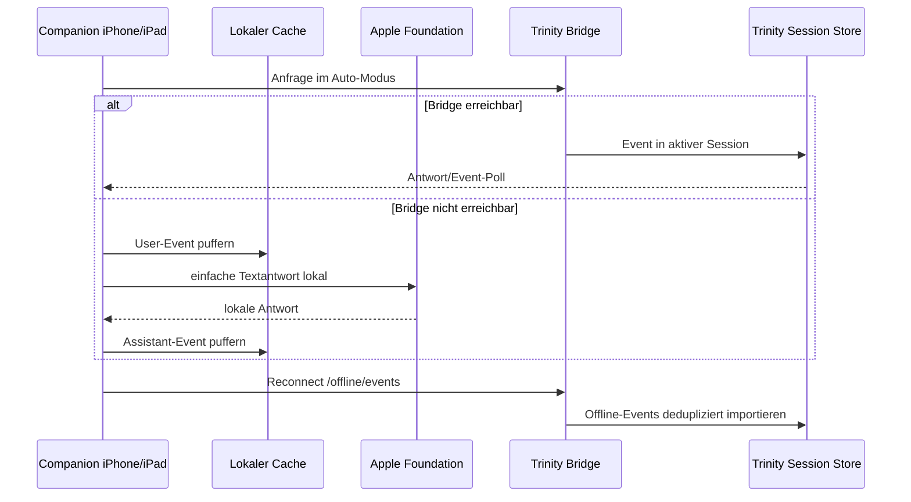

# Companion Offline Sync und Foundation-Fallback

Ab v0.16.31 kann die Companion-App nicht nur offline puffern, sondern auch
zwischen Server-Prioritaet und lokalem Apple-Foundation-Modus wechseln.

## Betriebsmodi

| Modus | Verhalten |
|---|---|
| **Auto** | Trinity Server hat Prioritaet. Wenn die Bridge nicht erreichbar ist, cached die App lokal und kann einfache Textantworten ueber Apple Foundation Models erzeugen. |
| **Foundation** | Textantworten werden bevorzugt lokal auf iPhone/iPad erzeugt. Die Events werden lokal gespeichert und spaeter mit Trinity synchronisiert. |

In beiden Modi bleiben Sessions, Arbeitsraeume, Notizen und Chat-Events auf dem
Geraet verfuegbar. Der aktuell aktive Modus wird oben in der Companion-App
angezeigt.

## Synchronisationsmodell



## Was gecacht wird

- letzte bekannte Arbeitsraeume,
- Sessions und aktive Session,
- lokale Chat-Events pro Session,
- nicht synchronisierte User-/Assistant-Events,
- finale STT- und Chat-Outbox-Eintraege.

## Was beim Reconnect passiert

Die Companion-App sendet lokale Offline-Events an:

```text
POST /offline/events
```

Trinity importiert diese Events idempotent. Bereits bekannte lokale Event-IDs
werden uebersprungen, damit beim Wiederverbinden nichts doppelt erscheint.

## Grenzen des lokalen Foundation-Modus

Apple Foundation Models sind als schlanker, privater Textfallback gedacht. Ohne
Trinity-Server sind nicht verfuegbar:

- BrainVault-Agenten, Pi, Codex, OpenCode und andere Harnesses,
- Websuche, RAG, Memory-Dreaming und serverseitige Indizes,
- Datei-, PDF-, Bild- und Excel-Auswertung,
- Medienerzeugung ueber ComfyUI, fal.ai oder Sandbox,
- geplante Jobs und serverseitige Automatismen.

Wenn ein Auftrag diese Funktionen benoetigt, sollte der Modus auf **Auto**
stehen und die Trinity-Bridge erreichbar sein.

