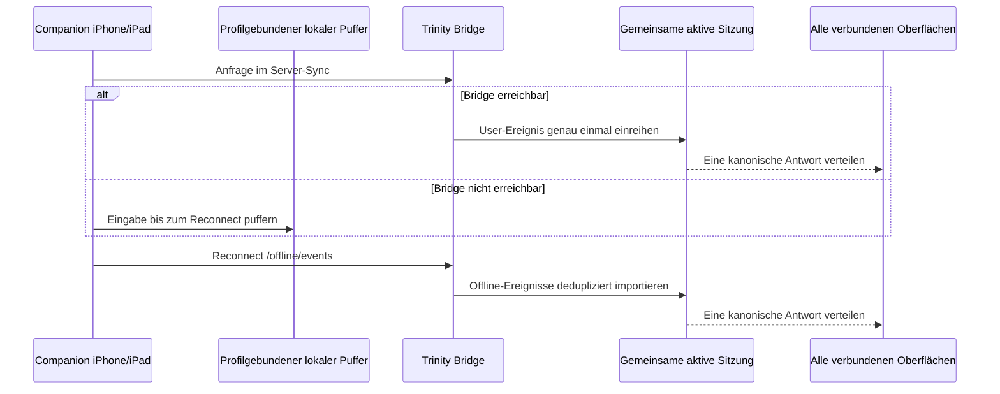

# Companion Offline-Puffer und gemeinsame Sitzung

Die Companion-App ist ein weiteres Fenster auf die eine aktive Sitzung der
gewählten Trinity-Instanz. Erkannte Sprache und getippte Nachrichten können
offline gepuffert werden. Eine verbindliche Antwort erzeugt ausschließlich die
Server-Trinity und verteilt sie danach identisch an alle Kanäle.

## Betriebsmodi

| Modus | Verhalten |
|---|---|
| **Server-Sync** | Trinity beantwortet die Anfrage genau einmal; alle verbundenen Oberflächen sehen dasselbe Ereignis. |
| **Offline-Puffer** | Text und finale STT-Eingaben werden lokal gespeichert und nach dem Reconnect an die gemeinsame Server-Sitzung übergeben. |

Arbeitsräume, ältere Sitzungen, Notizen und bereits geladene Chat-Ereignisse
bleiben auf dem Gerät lesbar. Pro Verbindungsprofil gibt es einen getrennten
lokalen Cache; BIZ, PRIVAT und TEST werden nicht vermischt.

## Offline-Talk

Wenn die Bridge nicht erreichbar ist, behandelt die Companion-App finale
STT-Eingaben so:

1. Ohne Wakeword wird der Text als `transcript` lokal gespeichert.
2. Mit Wakeword, zum Beispiel `Trinity, erkläre ...`, wird der Text als
   User-Ereignis gepuffert.
3. Es wird keine lokale Parallelantwort erzeugt.
4. Beim Reconnect werden Transcript- und User-Ereignisse dedupliziert an die
   Trinity-Bridge übertragen.
5. Die Server-Trinity beantwortet den Auftrag einmal; diese Antwort erscheint
   danach auf Desktop, Telegram, G2, iPhone, iPad und Web.

## Synchronisationsmodell



## Was gecacht wird

- letzte bekannte Arbeitsräume und Sitzungen,
- die zuletzt bekannte gemeinsame aktive Sitzung,
- lokale Chat-Ereignisse pro Sitzung,
- nicht synchronisierte User- und Transcript-Ereignisse,
- finale STT- und Chat-Outbox-Einträge.

## Was beim Reconnect passiert

Die Companion-App sendet lokale Offline-Ereignisse an:

```text
POST /offline/events
```

Trinity importiert diese Ereignisse idempotent. Bereits bekannte lokale
Ereignis-IDs werden übersprungen. Anschließend ordnet die Bridge neue Eingaben
der aktuell aktiven serverseitigen Sitzung zu.

## Grenzen des Offline-Puffers

Ohne Trinity-Server sind weder die verbindliche Antwort noch folgende
Funktionen verfügbar:

- BrainVault-Agenten, Pi, Codex, OpenCode und andere Harnesses,
- Websuche, RAG, Memory-Dreaming und serverseitige Indizes,
- Datei-, PDF-, Bild- und Excel-Auswertung,
- Medienerzeugung über ComfyUI, fal.ai oder Sandbox,
- geplante Jobs und serverseitige Automatismen.
