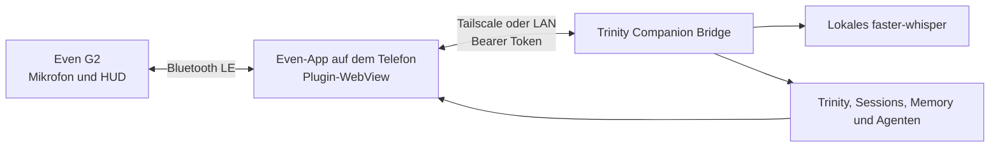

# Even Realities G2 mit Trinity

Trinity kann die Even Realities G2 als unaufdringliches Vorlesungs-HUD und Mikrofon verwenden. Das G2-Plugin ist ein getrenntes Projekt und wird nicht mit dem normalen Trinity-Desktop-Installer ausgeliefert.

## Architektur



Die Brille verbindet sich nicht direkt mit Mac oder Windows. Das Telefon mit der Even-App ist technisch immer der BLE- und Netzwerk-Relay. Die separate Trinity-iPhone-App wird fuer diesen Weg nicht benoetigt.

## G2-Oberflaeche

- links oben: Bubble-Hinweis und optional bis zu fuenf Vorbereitungspunkte
- rechts oben: Anzahl neuer Medien sowie aktives Profil und Modus
- links unten: letzte Transkription oder Trinity-Antwort
- rechts unten: Uhrzeit
- Mitte: bewusst frei

Das G2-Display ist monochrom. Die Trinity-Ampel wird daher mit `!`, `!!` und `!!!` dargestellt. Die Brille hat keinen Lautsprecher; Antworten erscheinen als Text.

## Modi

- **Zuruf:** Gesprochenes wird transkribiert und durch Trinitys normalen Wakeword-Pfad verarbeitet.
- **Konversation:** Jede abgeschlossene Aeusserung wird wie eine Chatnachricht an Trinity geschickt.
- Einfacher Druck am Brillenbuegel wechselt den Modus. Wischen wechselt zwischen den beiden Serverprofilen.

Sprachbefehle:

- `Trinity, Modus Zuruf`
- `Trinity, Modus Konversation`
- `Trinity, neue Session Wirtschaftsinformatik`
- `Trinity, ordne diese Session dem Arbeitsraum Spieltheorie zu`
- `Trinity, bereite Wirtschaftsinformatik vor`

## Installation auf der G2

1. Even-App installieren, G2 koppeln und Firmware aktualisieren.
2. Mit demselben Konto bei Even Hub anmelden. Danach die Even-App vollstaendig beenden und erneut starten, damit der Entwicklerbereich erscheint.
3. Node.js 22 LTS sowie die Even-Hub-Werkzeuge installieren:

   ```bash
   npm install -g @evenrealities/evenhub-cli @evenrealities/evenhub-simulator
   ```

4. Im getrennten Projekt `TrinityEvenG2` die Datei `.env.local` auf die erlaubten Trinity-Origins setzen. Beispiel:

   ```text
   VITE_TRINITY_ORIGINS=http://PRIVATE-TAILSCALE-IP:8765,http://BUSINESS-TAILSCALE-IP:8765
   ```

   In diese Datei gehoeren keine Tokens. Even verlangt fuer jede erreichbare Server-Origin einen statischen Whitelist-Eintrag im Paket.

5. Trinity auf dem Zielrechner starten. Unter **Einstellungen -> System -> Companion Bridge** Bridge aktivieren, Host `0.0.0.0`, Port `8765` und einen langen Bearer-Token setzen.
6. Plugin installieren und lokal starten:

   ```bash
   cd "/PFAD/ZU/TrinityEvenG2"
   npm install
   npm run test
   npm run dev
   ```

7. In einem zweiten Terminal einen QR-Code fuer die vom Telefon erreichbare Adresse des Macs erzeugen:

   ```bash
   npx evenhub qr --url "http://MAC-IP:5173" -e
   ```

8. In der Even-App den QR-Code im Entwicklerbereich scannen. Im Telefonfenster des Plugins Profilname, Trinity-URL und Bearer-Token eintragen und **Verbindung testen** waehlen.

Fuer einen dauerhafteren Test `npm run pack` ausfuehren und `TrinityEvenG2.ehpk` im Even-Hub-Portal als privaten Test hochladen. Lokales QR-Sideloading ist fuer schnelle Entwicklung gedacht und uebersteht laut Even nicht jeden Sperr- oder Hintergrundwechsel.

## Privat und geschaeftlich

Ein Plugin mit zwei lokalen Profilen ist der einfachste Weg. URLs und Tokens bleiben getrennt, ebenso die zuletzt verwendeten Sessions. Fuer eine harte organisatorische Trennung koennen spaeter zwei Pakete mit unterschiedlichen `package_id`-Werten und jeweils nur einer freigegebenen Origin gebaut werden.

## Datenschutz und Grenzen

- Der Quellcode und die oeffentliche Vorlage enthalten keine Nutzerdaten, Serveradressen oder Tokens. Ein privates Paket enthaelt technisch bedingt seine freigegebenen Server-Origins, aber keine Tokens.
- Tokens werden im lokalen Even-App-Speicher gehalten.
- Audio wird nur an das aktive eigene Trinity-Profil gesendet und dort mit dem vorhandenen Whisper-Modell verarbeitet.
- Die interne Textausgabe der Even-App **Conversate** ist im oeffentlichen Plugin-SDK nicht als wiederverwendbarer Transkriptionsdienst verfuegbar. Der erste Trinity-Client zeigt deshalb fertige Aeusserungen nach einer kurzen Sprechpause statt jedes einzelne Wort sofort.
- Die Netzwerkliste ist ein Sicherheitsmerkmal von Even und muss bei einer neuen Server-Origin neu gepackt werden.
- Ein allgemein verteilbares Paket mit frei eingebbaren Serverzielen ist wegen dieser statischen Netzwerkliste derzeit nicht moeglich. Dafuer waere spaeter ein fester, datenschutzgerecht betriebener Trinity-Relay-Domainname oder eine erweiterte Even-Partnerschnittstelle erforderlich.
