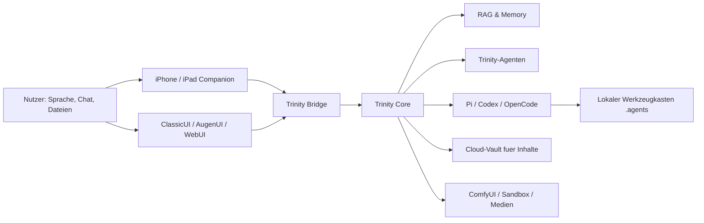

# Trinity Feature Overview

Diese Seite ist die schnelle Orientierung fuer den aktuellen Trinity-Stand.
Die README bleibt der Einstieg; hier steht, was die Kiste inzwischen praktisch
kann und wo die Details liegen.

## Kernidee

Trinity ist keine einzelne Chatbot-Oberflaeche, sondern eine lokale Control
Plane fuer persoenliche KI-Arbeit:

- **Desktop/Server:** macOS, Windows 11 oder Linux halten Runtime, Bridge,
  lokale Modelle, RAG, Agenten, Medienworkflows und WebUI.
- **Companion:** iPhone und iPad dienen als Mikrofon, mobile Chatoberflaeche,
  Presenter-Display und Offline-Client.
- **Lokaler Agenten-Werkzeugkasten:** externe Fachagenten liegen in einer
  lokalen, ueber Git gesicherten Ablage und koennen durch Pi, Codex, OpenCode oder andere Harnesses
  genutzt werden.
- **Arbeitsraeume und Sessions:** Arbeit wird in Arbeitsraeume, Sessions,
  Notizen, Summaries und Assets gegliedert, statt in einen endlosen Chatstrom.

## Die wichtigsten Feature-Familien

### Companion und Offline-Betrieb

- iPhone/iPad synchronisieren Arbeitsraeume, Sessions, Notizen und Chat-Events.
- Standardprofile sind Arbeit, Privat und Development. Mindestens zwei Profile
  bleiben bestehen; weitere Verbindungen können per Plus-Icon ergänzt werden.
  Chat, aktive Sitzung, Offline-Puffer und Medienbibliothek sind profilgebunden.
- Pro Trinity-Profil gibt es genau eine serverseitig aktive Sitzung. Desktop,
  Telegram, G2, iPhone, iPad und Web zeigen denselben Verlauf und dieselbe
  fertige Antwort; ältere Sitzungen bleiben erhalten und können gemeinsam
  wieder geöffnet werden.
- Ohne Verbindung bleiben gecachte Sessions sichtbar; neue Nachrichten werden
  gepuffert.
- Offline-Eingaben werden lokal gepuffert. Erst die Server-Trinity erzeugt nach
  dem Reconnect die verbindliche Antwort, damit keine widersprüchliche zweite
  Companion-Antwort entsteht.

Details: [Companion Offline Sync](COMPANION_OFFLINE_SYNC.md)

### Vortrag, Web und Medien

- iPad-Vortragsansicht fuer PDF- und HTML-Folien.
- Stifte, Marker, Laserpointer, Zoom, Seitenleiste, Key-Commands und
  Medien-Overlays.
- Webansicht fuer Unterrichtsseiten, Dashboards, Mentimeter, SAP, Intranet oder
  lokale Webdienste.
- Generierte Bilder, Audio, Video, Simulationen, Timer und Pyodide-/Sandbox-
  Ergebnisse erscheinen als wiederaufrufbare, profilgebundene Assets und
  bleiben erhalten, bis sie ausdrücklich aus der Ergebnisliste gelöscht werden.

### Arbeitsraeume, Sessions und Notizen

- Sessions koennen benannt, umbenannt, angeheftet, archiviert, geloescht und
  zusammengefasst werden.
- Das Schließen einer aktiven Session startet automatisch die Summary und
  aktiviert atomar eine neue gemeinsame Session auf allen Geräten.
- Arbeitsraeume buendeln Sessions, Notizen und Summaries nach Kontext, etwa
  Vorlesung, Buchprojekt, Forschung oder Office.
- Neue Sessions starten mit Zeitstempel und koennen spaeter einem Arbeitsraum
  zugeordnet werden.
- Summaries werden zusätzlich in der jeweiligen Sitzungsmappe gespeichert. Die
  Desktop-Zuordnung zu einem Projekt oder Vorlesungsmodul nimmt Summary,
  Transkript und Sitzungsmedien gemeinsam mit; danach können sie für
  Vorabbriefings und RAG genutzt werden.

Details: [Workspace-/Session-Roadmap](WORKSPACES_SESSIONS_NOTES_ROADMAP.md)

### Agenten und Harnesses

- Trinity-eigene Agenten bleiben in der lokalen Runtime.
- Externe Fachagenten liegen im lokalen Agenten-Werkzeugkasten unter `.agents`.
- Pi ist der Standard-Harness fuer laufende externe Agentenarbeit.
- Codex ist der Builder-Harness fuer neue Agenten, Imports, Refactorings, Tests
  und Quality-Gates.
- Agents-Ansichten zeigen Favoriten, Status, Rechte, Jobzahlen und startbare
  Hauptagenten.

Details:

- [Agenten-Oekosystem](AGENT_ECOSYSTEM.md)
- [Agenten-Werkzeugkasten](BRAINVAULT_AGENTS.md)
- [Control Plane und BrainVault](CONTROL_PLANE_MAINHUB.md)

### Oberflaechen

- **ClassicUI:** Desktop-App mit Talk, Vortrag, Web, Chat, Agent, Control und
  Live/Diagnose.
- **AugenUI:** schwebende Minimaloberflaeche fuer Vorlesung und Zurufe.
- **WebUI:** Browseroberflaeche fuer Headless/Linux oder Remote-Clients.
- **Terminal/TUI:** Headless, Diagnose, Slash-Commands und Serverbetrieb.
- **Companion:** iPhone/iPad fuer STT, TTS, Presenter, Chat, Agenten und Control.

## Was offline bewusst nicht geht

Apple Foundation Models sind nur ein lokaler Text-Fallback. Ohne Trinity-Server
stehen nicht zur Verfuegung:

- externe Agenten und Harness-Jobs,
- Websuche und Online-Recherche,
- RAG ueber serverseitige Indizes,
- Datei-, PDF-, Bild- oder Excel-Analyse,
- Bild-, Audio-, Video- und Simulationserzeugung,
- serverseitige Automatismen und geplante Jobs.

Das ist Absicht: Der Offline-Modus soll stabil, schnell und privat bleiben.
