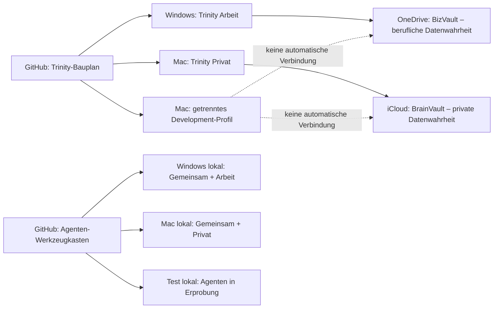

# Trinity-Architektur – Phase 1: verbindliche Spielregeln

Status: verbindliche Fassung 4
Ursprünglich beschlossen: 20. Juli 2026
Nachgebessert: 23. Juli 2026
Grundlage: Codex-Aufgabe `019f7b1e-e6c9-7fc0-8c92-aa10c0c3c6b3`

## 1. Die Architektur in einem Satz

> **GitHub enthält die Baupläne. Der zuständige Rechner führt Trinity und die
> Agenten aus. Die lokale Runtime hält den laufenden Zustand. BizVault und
> BrainVault enthalten als einzige Datenwahrheit die dauerhaften Inhalte.**

Damit gibt es vier klar verschiedene Dinge:

| Was? | Maßgeblicher Ort |
|---|---|
| Trinity- und Agentencode | private GitHub-Repositories; lokal installiert |
| laufende Trinity-Zustände | lokale Runtime des zuständigen Rechners |
| dauerhafte berufliche Inhalte | OneDrive/`BizVault` |
| dauerhafte private Inhalte | iCloud Drive/`BrainVault` |

Cloud-Synchronisation und Backups dürfen technische Kopien erzeugen. Sie
erzeugen aber keine zweite fachliche Wahrheit.



## 2. Die verbindlichen Namen

Die verständlichen Namen werden in Oberflächen und Dokumentation verwendet.
Die kurzen technischen Namen bleiben nur für Konfigurationen und Regeln.

| Sichtbarer Name | Technischer Name | Bedeutung |
|---|---|---|
| **Arbeit** | `BIZ` | Lehre, Forschung, Hochschule, Verwaltung und sonstige berufliche Arbeit |
| **Privat** | `PRIVAT` | persönliche, familiäre und private kreative Arbeit |
| **Development** | `TEST` | isolierte Versuche mit Testdaten; keine Ablage für ungeklärte Inhalte |
| **Gemeinsam** | `SHARED` | Agentenklasse, die in Arbeit und Privat installiert werden darf; kein Datenprofil |

### BizVault

Der **BizVault** ist die einzige fachliche Datenwahrheit für dauerhafte
berufliche Inhalte. Er liegt in OneDrive.

### BrainVault

Der **BrainVault** ist trotz seines historischen Namens der private Vault. Er
ist die einzige fachliche Datenwahrheit für dauerhafte private Inhalte und
liegt in iCloud Drive.

### BrainVault_LEGACY

`BrainVault_LEGACY` ist der alte, gemischte Bestand. Er ist Migrationsquelle und
Wiederherstellungsbestand, aber kein dritter aktiver Vault. Bis zur geprüften
Migration wird dort nichts automatisch gelöscht oder neu einsortiert.

## 3. Was „Autorität“ genau bedeutet

Es gibt zwei unterschiedliche Arten von Autorität:

1. **Datenautorität:** Der jeweilige Vault ist die Wahrheit für Dokumente,
   Projekte, Quellen, Vorlagen und fertige Ergebnisse.
2. **Trinity-Autorität:** Der festgelegte Rechner ist die Wahrheit für das
   Profil, dessen aktive Sessions, Memory, Jobs, Freigaben und Konfiguration.

Diese Unterscheidung verhindert ein Missverständnis: Eine Datei im BizVault
bleibt auch dann die maßgebliche Fassung, wenn sie am Mac bearbeitet wurde.
Eine berufliche Trinity-Sitzung, die diese Datei verarbeitet, läuft dennoch
auf der Windows-Autorität.

| Profil | Trinity-Autorität | Inhalts-Vault | Darf das Profil lokal ausführen? |
|---|---|---|---|
| Arbeit | **Windows-System** (derzeit Windows-VM) | OneDrive/`BizVault` | nur Windows |
| Privat | **Mac** | iCloud/`BrainVault` | nur Mac |
| Development | separate Test-Runtime auf dem Mac | zunächst kein Cloud-Vault | nur die Test-Runtime |

Der Ubuntu-Rechner ist keine vierte Autorität. Er darf als abgesicherter
LLM-Inferenzdienst für Arbeit dienen, besitzt aber weder berufliches Memory
noch einen eigenen Inhalts-Vault.

## 4. Was lokal auf jedem Autoritätsrechner liegt

Jede produktive Trinity-Instanz besteht lokal aus drei getrennten Bereichen:

### A. Trinity-Installation

Die installierte App, der Trinity-Code, Python und Abhängigkeiten. Quelle ist
das Trinity-Repository auf GitHub. Die Installation liegt nicht im Cloud-Vault.

### B. Agenten-Werkzeugkasten

Ausführbare Agenten mit Beschreibungen, Tests, Skripten und Abhängigkeiten.
Quelle ist das private Agenten-Repository auf GitHub. Installiert werden nur die
für den Rechner erlaubten Klassen:

| Rechner | Erlaubte Agentenklassen |
|---|---|
| Windows | Gemeinsam + Arbeit |
| Mac, private Runtime | Gemeinsam + Privat |
| Mac, Development-Runtime | Development; bei Bedarf ausdrücklich freigegebene Testkopien |

Ein Agent aus `Gemeinsam` ist derselbe versionierte Bauplan, wird aber auf jedem
Rechner lokal installiert. Seine Memories, Logs und Ergebnisse werden nicht
zwischen Arbeit und Privat geteilt.

### C. Trinity-Runtime

Der veränderliche Betriebszustand: aktive Sessions, Memory, Jobs, Queues,
SQLite-Datenbanken, Logs, Caches, temporäre Dateien, lokale Konfiguration und
Secrets. Jede Runtime gehört genau zu einem Profil und liegt nicht in OneDrive
oder iCloud.

## 5. Was in den Vault gehört

Ein Vault enthält alle dauerhaften fachlichen Inhalte des jeweiligen Profils –
nicht nur aktuelle Trinity-Projekte. Dazu gehören ausdrücklich auch Dinge, die
erst in einigen Jahren wieder gebraucht werden könnten.

In den Vault gehören:

- aktive und abgeschlossene Projekte
- Dokumente, Bücher, Präsentationen und Medien
- Wissen, Quellen, Notizen und Nachschlagebestände
- Vorlagen und wiederverwendbare Bausteine
- fertige Werke und veröffentlichte Ergebnisse
- bewusst aufbewahrte Sitzungszusammenfassungen und Artefakte
- verständliche Status-, Schlagwort- und Herkunftsinformationen
- dauerhaft benötigtes Agentenwissen, aber kein ausführbarer Agentencode

Nicht in den Vault gehören:

- aktive Trinity-Datenbanken, Sessions, Jobs, Queues oder Locks
- lokale RAG-, Such- oder Graphify-Indizes
- Cache, temporäre Renderings oder rohe technische Logs
- Passwörter, Tokens, API-Schlüssel oder andere Secrets
- Python-Umgebungen und installierte Programme
- ausführbarer Agentencode als maßgebliche Quelle

## 6. Verbindliche, verständliche Vault-Strukturen

BizVault und BrainVault sind absichtlich **nicht gleich aufgebaut**. Der
berufliche Bestand wird nach den tatsächlich wiederkehrenden Hochschulaufgaben
geordnet; der private Bestand bleibt projektbezogen.

### BizVault – Arbeit

```text
BizVault/
├── 00 Eingang und noch zuordnen/
├── 10 Lehre und Lehrmaterial/
├── 20 Prüfungen und Bewertungen/
├── 30 Hochschulorganisation/
├── 40 Forschung und Transfer/
├── 50 Vorträge und Veranstaltungen/
├── 60 Abschlussarbeiten und Betreuung/
├── 70 Vorlagen und wiederverwendbare Bausteine/
├── 80 Frühere und abgeschlossene Vorgänge/
└── 90 Überblick und Ablagehilfe/
```

Diese Struktur bildet die fachliche Logik des bisherigen CampusHub ab:

- `TeachLab` wird später kontrolliert **Lehre und Lehrmaterial** zugeordnet.
- `Prüfungen` wird nach Prüfungszeitraum und Modul unter **Prüfungen und
  Bewertungen** übernommen.
- `Ops` wird **Hochschulorganisation** zugeordnet.
- `ThesisForge` wird **Abschlussarbeiten und Betreuung** zugeordnet.
- Forschung und Vorträge erhalten eigene, sofort sichtbare Bereiche, auch wenn
  sie im Altbestand bislang an unterschiedlichen Orten lagen.
- `projects/Automatismen` ist ausdrücklich **keine** Migrationsquelle für diese
  fachliche BizVault-Struktur.

Lehrmodule liegen direkt unter `10 Lehre und Lehrmaterial`; Prüfungszeiträume
direkt unter `20 Prüfungen und Bewertungen`. Zusätzliche Zwischenebenen werden
nur angelegt, wenn sie wirklich Orientierung schaffen.

### BrainVault – Privat

```text
BrainVault/
├── 00 Noch zuordnen/
├── 10 Aktive Projekte/
├── 20 Wissen und Quellen/
├── 30 Vorlagen und Bausteine/
├── 40 Abgeschlossene Projekte/
├── 50 Fertige Werke und Veröffentlichungen/
└── 90 Inhaltsverzeichnis und Schlagwörter/
```

Die deutschen Namen sind verbindlicher als technische Begriffe wie `Input`,
`Output`, `Artifacts` oder `Registry`. Die jeweiligen 90er-Ordner enthalten
kleine, neu aufbaubare Kataloge und Manifeste – niemals die einzigen Exemplare
der Originale.

Ein Vorhaben erhält höchstens so viel Unterstruktur wie wirklich nötig. Ein
Lehrbuch liegt beruflich beispielsweise direkt hier:

```text
10 Lehre und Lehrmaterial/
└── Lehrbuch Investition und Finanzierung/
    ├── Projektübersicht.md
    ├── Arbeitsmaterial/
    ├── Entwürfe/
    └── Fertige Fassungen/
```

## 7. Wie gearbeitet wird

### Beruflicher Auftrag

1. Ein im Profil Arbeit angemeldeter Client sendet den Auftrag an Trinity Arbeit auf
   Windows.
2. Trinity und die beruflichen Harnesses arbeiten auf Windows.
3. Dauerhafte Arbeitsdateien werden direkt im BizVault geöffnet und gespeichert.
4. Nur technische Zwischenstände bleiben in der lokalen beruflichen Runtime.
5. OneDrive synchronisiert die Vault-Dateien; es synchronisiert nicht die
   Runtime oder ausführbaren Agenten.

Der Mac darf BizVault-Dateien als normaler OneDrive-Dateiclient öffnen und
bearbeiten. Für Trinity-, Codex- oder OpenCode-Aufträge im Profil Arbeit
bleibt er jedoch Remote-Client der Windows-Autorität.

### Privater Auftrag

1. Ein privat angemeldeter Client sendet den Auftrag an Trinity Privat auf dem
   Mac.
2. Trinity und die privaten Harnesses arbeiten auf dem Mac.
3. Dauerhafte Arbeitsdateien werden direkt im BrainVault geöffnet und gespeichert.
4. Nur technische Zwischenstände bleiben in der lokalen privaten Runtime.
5. iCloud synchronisiert die Vault-Dateien; es synchronisiert nicht die
   Runtime oder ausführbaren Agenten.

### Testauftrag

1. Der Auftrag läuft ausschließlich in der separaten Test-Runtime.
2. Verwendet werden synthetische Daten oder ausdrücklich freigegebene Kopien.
3. Ein Test erhält keinen automatischen Schreibzugriff auf BizVault oder
   BrainVault.
4. Erst ein geprüfter Export darf als neue Version in ein produktives Profil
   übernommen werden.

## 8. Profilübergreifende Übernahmen

Zwischen Arbeit und Privat gibt es keine automatische Synchronisation. Eine
Übernahme ist nur erlaubt, wenn der Nutzer sie für einen konkret benannten
Zweck bestätigt.

Die Übernahme dokumentiert mindestens:

- Quelldatei und Quellprofil
- Zielprofil und Zielordner
- Zweck der Übernahme
- Datum und ausführende Person beziehungsweise Instanz
- ob personenbezogene oder vertrauliche Informationen entfernt wurden

Es wird zunächst **kopiert**, am Ziel geprüft und erst danach am Ursprung über
eine mögliche Löschung entschieden. Eine Profilübernahme ist kein stilles
Verschieben.

## 9. Erlaubte Clients und eindeutige Profilwahl

| Client oder System | Arbeit | Privat | Development | Verbindliche Rolle |
|---|:---:|:---:|:---:|---|
| Windows-System | lokal | nein | nein | Autorität für Arbeit |
| Mac | remote + Dateien | lokal | lokal, getrennt | Autorität für Privat; Testhost |
| iPhone-App | remote | remote | nein | bewusste Profilwahl |
| iPad-App | remote | remote | nein | bewusste Profilwahl |
| Even G2 über Telefon | remote | remote | nein | übernimmt das am Telefon sichtbare Profil |
| Telegram Arbeit | remote | nein | nein | eigener Bot nur für Arbeit |
| Telegram Privat | nein | remote | nein | eigener Bot nur für Privat |
| Ubuntu-Inferenzhost | Backend | nein | nein | beruflicher LLM-Dienst ohne Nutzerprofil |

Für iPhone und iPad gelten zwingend:

- getrennte Serveradressen und Zugangsdaten
- klar sichtbarer Profilname **Arbeit**, **Privat** oder **Development**
- getrennte lokale Caches und Sitzungskennungen
- kein automatischer Wechsel anhand des zuletzt geöffneten Dokuments
- vor einem Profilwechsel Abschluss oder ausdrückliches Parken der laufenden
  Sitzung

Für Telegram werden zwei getrennte Bots verwendet. Die frühere Alternative
„getrennte Bots oder getrennte Chats“ ist damit aufgehoben.

## 10. Sessions, Memory, RAG und Graphify

### Sessions und Memory

- Arbeit und Privat besitzen vollständig getrennte Sessions und Memories.
- Pro Profil gibt es eine gemeinsam sichtbare aktuelle Sitzung; ältere
  Sitzungen können gespeichert und später wieder geöffnet werden.
- Ein Clientwechsel innerhalb desselben Profils darf dieselbe aktuelle Sitzung
  fortsetzen.
- Ein Profilwechsel setzt niemals die Sitzung des anderen Profils fort.
- Dauerhaft wertvolle Zusammenfassungen werden bewusst im passenden Vault
  abgelegt; rohe Runtime-Daten bleiben lokal.

### RAG

Die Originalquellen liegen im zuständigen Vault. Der daraus erzeugte Suchindex
liegt lokal bei der jeweiligen Runtime und kann neu aufgebaut werden. Berufliche
und private Quellen werden niemals in einem gemeinsamen produktiven Index
vermischt.

### Graphify

Graphify läuft lokal auf dem jeweiligen Autoritätsrechner. Es erstellt pro
Profil einen getrennten, neu aufbaubaren Beziehungsindex aus dem zuständigen
Vault.

Graphify ist eine Landkarte, nicht der Aktenschrank:

- Originale bleiben im Vault.
- Der Graphify-Index liegt lokal.
- Graphify darf Vorschläge für Beziehungen und Schlagwörter machen.
- Ein Vorschlag wird erst nach Bestätigung zur verbindlichen Kataloginformation.
- Der historische Graph im `BrainVault_LEGACY` bleibt bis zum Neuaufbau nur
  Orientierung und ist nicht die aktuelle Wahrheit.

## 11. Software- und Agentenverteilung

Trinity-Code wird über das Trinity-Repository und versionierte Releases
verteilt. Agentencode wird über ein getrenntes privates Repository
**Agenten-Werkzeugkasten** verteilt.

Kein Harness bildet eine eigene Datenwelt. Trinity, Codex, OpenCode und
weitere Harnesses greifen innerhalb eines Profils auf denselben Vault zu und
verwenden die lokal installierten, für dieses Profil erlaubten Agenten.

Cloud-Vaults werden nicht zur Softwareverteilung verwendet. Ein Agent wird
zuerst versioniert, dann profilbezogen installiert und erst danach lokal
ausgeführt.

## 12. Konflikt- und Sicherheitsregeln

- Vor dem Überschreiben einer inzwischen synchronisierten Datei werden
  Änderungszeit, Versionsstand oder Prüfsumme verglichen.
- Bei konkurrierenden Änderungen entstehen zwei gekennzeichnete Fassungen; es
  wird nicht still die vermeintlich ältere Datei gelöscht.
- Secrets stehen nur in lokalen Secret-Speichern oder lokalen
  Konfigurationsdateien, nie in Vault oder Git.
- Berufliche Agenten laufen nicht auf dem Mac im Profil Privat.
- Private Agenten laufen nicht auf Windows.
- Testagenten erhalten keinen ungeprüften produktiven Schreibzugriff.
- Automatisches Lernen oder Katalogisieren verändert Originaldateien nicht
  ohne nachvollziehbare Freigabe.
- Cloud-Synchronisation ist kein Backup.

## 13. Die konkreten Pfade im jetzigen Übergang

- Aktiver privater Inhalts-Vault auf dem Mac: `/Users/matmax/Library/Mobile Documents/com~apple~CloudDocs/BrainVault`
- Alter gemischter Bestand: `/Users/matmax/Library/Mobile Documents/com~apple~CloudDocs/BrainVault_LEGACY`
- Beruflicher Inhalts-Vault, auf dem Mac durch OneDrive sichtbar: `/Users/matmax/Library/CloudStorage/OneDrive-HochschulefürWirtschaftundUmwelt/BizVault`
- Aktive lokale Trinity-Installation auf dem Mac: `/Users/matmax/Trinity_Assistant`
- Aktive lokale Mac-App: `/Users/matmax/Applications/Trinity.app`
- Lokaler Agenten-Werkzeugkasten auf dem Mac: `/Users/matmax/.agents`
- Aktive lokale Windows-Installation:
  `C:\Users\matmax\AppData\Local\Trinity`
- Lokale Windows-Runtime:
  `C:\Users\matmax\AppData\Local\Trinity\TrinityRuntime`
- Beruflicher Inhalts-Vault auf Windows:
  `C:\Users\matmax\OneDrive - Hochschule für Wirtschaft und Umwelt\BizVault`

Die Windows-Pfade wurden in Phase 2 bestätigt. Der per OneDrive synchronisierte
BizVault bleibt unabhängig vom jeweiligen lokalen Synchronisationspfad dieselbe
fachliche Datenwahrheit.

## 14. Was Phase 1 entschieden hat – und was noch nicht

Verbindlich entschieden sind:

- die sichtbaren Namen Arbeit, Privat und Development
- Windows als einzige Trinity-Autorität für Arbeit
- Mac als einzige Trinity-Autorität für Privat
- eine separate Mac-Test-Runtime als initiales Development-Profil
- BizVault und BrainVault als einzige dauerhafte Datenwahrheiten
- lokale Runtime, lokale Agenten und lokale Indizes
- das private Agenten-Repository als Agentenquelle
- die erlaubten Clients und ihre Profile
- die oben beschriebene flache deutsche Vault-Struktur
- getrennte Telegram-Bots für Arbeit und Privat
- kontrollierte statt automatische Profilübernahmen

Noch nicht entschieden oder noch nicht ausgeführt sind:

- welche einzelnen Legacy-Dateien nach Arbeit oder Privat migriert werden
- welche Agenten Arbeit, Privat, Gemeinsam, Development oder Löschen erhalten
- welche alten Sessions dauerhaft aufgehoben werden
- welche RAG-Quellen welchem Profil angehören
- der Neuaufbau der getrennten RAG- und Graphify-Indizes

## 15. Abnahme von Phase 1

Die Architekturentscheidung ist fachlich vollständig. Technisch gilt Phase 1
erst als umgesetzt, wenn folgende Kontrollen protokolliert sind:

- [x] Begriffe und verständliche Namen verbindlich definiert
- [x] Windows als Trinity-Autorität für Arbeit festgelegt
- [x] Mac als Trinity-Autorität für Privat festgelegt
- [x] Datenwahrheit und Trinity-Autorität eindeutig unterschieden
- [x] Profile aller geplanten Clients entschieden
- [x] erlaubte und verbotene Datenflüsse dokumentiert
- [x] flache deutsche Vault-Struktur festgelegt
- [x] flache deutsche Hauptordner in BizVault und BrainVault angelegt
- [x] Agenten, Runtime, RAG und Graphify von den Vaults getrennt
- [x] Mac-Konfiguration vollständig gegen diese Regeln geprüft
- [x] Windows-Konfiguration, Pfade und Profil gegen diese Regeln inventarisiert
- [ ] mobile Clients auf getrennte Profile und Caches geprüft
- [x] getrennte Telegram-Bots eingerichtet und technisch geprüft

Bis die verbleibende mobile technische Prüfung abgeschlossen ist, finden keine
automatischen Inhaltsmigrationen und keine Löschungen im Legacy-Bestand statt.
Eine spätere Änderung dieser Regeln benötigt eine neue versionierte
Architekturentscheidung.

### Behobene Mac-Abweichung

Die wesentlichen Mac-Pfade sind korrekt getrennt: Runtime lokal, BrainVault in
iCloud und Agenten lokal. Die Konfiguration trägt inzwischen ausdrücklich das
Profil `PRIVAT`. Creative Canvas wurde am 22. Juli 2026 nach
`/Users/matmax/TrinityCreativeCanvas` verlegt. Der LaunchAgent
`de.trinity.creativecanvas.plist` und seine technischen Logs verwenden nun
ausschließlich lokale Pfade. Der vorherige Cloud-Rest sowie ein geprüftes
Git-Bundle der vier lokalen Commits liegen wiederherstellbar unter
`/Users/matmax/Trinity-Recovery/2026-07-22-creative-canvas-localization`.

### Beschlossene Reihenfolge für Agenten

Die fachliche Agentenklassifizierung wird bewusst zurückgestellt, bis
Installation, Profile, Vaults, Sessions, Memory und Wiederherstellung sauber
inventarisiert sind. Agenten werden später nicht pauschal verteilt, sondern
bei tatsächlichem Bedarf manuell über Codex in die lokale Umgebung für Arbeit
oder Privat übernommen. Bis dahin findet keine automatische Agentenmigration
aus `BrainVault_LEGACY` statt.
