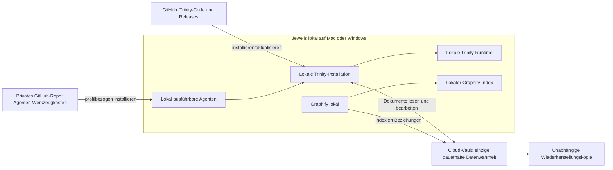

# Trinity-Architektur – Cheatsheet

Stand: 21. Juli 2026
Zielbild: Windows = **BIZ-Autorität**, Mac = **PRIVAT-Autorität**

## Der wichtigste Merksatz

> **GitHub enthält die Baupläne. Der Rechner führt sie aus. Die lokale Runtime
> hält den laufenden Zustand. Der Cloud-Vault enthält die dauerhaften Inhalte.**

Jede Datei hat genau **einen** maßgeblichen Aufbewahrungsort. Synchronisation
und Backups erzeugen technische Kopien, aber keine zweite fachliche Wahrheit.

## Das Schaubild



## 1. Trinity-Installation – lokal, nicht im Cloud-Ordner

Die Installation ist die **ausführbare Trinity-App** auf dem jeweiligen
Rechner. Dazu gehören der installierte Programmcode, Python-Umgebung,
Abhängigkeiten und Startprogramme.

- Mac: derzeit `/Users/matmax/Trinity_Assistant`
- eigentliche Mac-App: `/Users/matmax/Applications/Trinity.app`
- auf dem Schreibtisch: nur der Verweis `Trinity.app`
- Windows-Ziel: `%LOCALAPPDATA%\Trinity`
- Quelle für Installation und Updates: Trinity-Repository und versionierte
  Releases auf GitHub

Die lokale Installation ist **nicht** der Vault und **nicht** die Runtime.
Ein lokaler Git-Clone kann der Entwicklungsarbeitsplatz sein; die verbindliche
Code-Historie liegt im GitHub-Repository.

## 2. Nutzbare Agenten – lokal, nicht im Cloud-Ordner

Auf jedem Rechner liegen nur die Agenten, die das dort erlaubte Profil
benötigt, jeweils mit ihren lokal erforderlichen Abhängigkeiten.

| Rechner | Erlaubte installierte Agenten |
|---|---|
| Windows | Gemeinsam + Beruf (BIZ) |
| Mac | Gemeinsam + Privat + isolierte Test-Agenten |

Der private **Agenten-Werkzeugkasten auf GitHub** ist die maßgebliche Quelle
für Agentencode, Beschreibungen, Tests und Versionen. Sinnvolle Bereiche sind:

```text
Agenten-Werkzeugkasten/
├── Gemeinsam/
├── Beruf/
├── Privat/
└── In-Erprobung/
```

`Gemeinsam` ist dabei kein viertes Datenprofil: Diese Agenten werden lokal in
BIZ und PRIVAT installiert. `In-Erprobung` wird nur im Testbereich ausgefuehrt.

Von dort werden Agenten bewusst und profilbezogen lokal installiert. Die
Cloud-Vaults sind weder Softwareverteilung noch Quelle der Wahrheit für
ausführbaren Agentencode.

Aktive lokale Agentenablage auf dem Mac: `/Users/matmax/.agents`

## 3. Trinity-Runtime – lokal, nicht im Cloud-Ordner

Die Runtime ist der **veränderliche Betriebszustand** der laufenden
Trinity-Instanz:

- Trinity-Memory und aktive Sessions
- Jobs, Queues, Locks und lokale Datenbanken
- Logs, Cache und temporäre Arbeitsdateien
- Secrets und lokale Konfiguration
- lokale Such-, RAG- und Graphify-Indizes

Mac-Pfad derzeit:
`/Users/matmax/Trinity_Assistant/TrinityRuntime`

Windows-Ziel:
`%LOCALAPPDATA%\Trinity\TrinityRuntime`

**Wichtige Korrektur:** Trinity-Quellcode und Agenten-Quellcode gehören nicht
in die Runtime. Die Runtime soll aus Installation, Konfiguration,
Vault-Inhalten und Wiederherstellungskopien neu aufgebaut werden können.

## 4. Die beiden Vaults – als Einzige in Cloud-Ordnern

Ein Vault enthält die **dauerhaften fachlichen Inhalte**, mit denen Trinity,
Codex, Goose, OpenCode und andere Harnesses arbeiten. Er ist keine Kopie der
Runtime, sondern die einzige fachliche Datenwahrheit seines Profils.

| Profil | Name | Cloud | Autoritative Trinity-Instanz |
|---|---|---|---|
| BIZ | **BizVault** | OneDrive | Windows |
| PRIVAT | **BrainVault** | iCloud Drive | Mac |

In einen Vault gehören:

- aktive und abgeschlossene Projekte
- Dokumente, Quellen und dauerhaftes Wissen
- Vorlagen und wiederverwendbare Bausteine
- freigegebene Ergebnisse und Veröffentlichungen
- bewusst veröffentlichte Session-Zusammenfassungen und Artefakte
- Kataloge, Projektstatus, Tags und Manifeste
- dauerhaft benötigtes Agentenwissen, aber kein ausführbarer Agentencode als
  maßgebliche Quelle

Nicht in einen Vault gehören aktive Runtime-Datenbanken, Secrets, Locks,
Caches, rohe Logs oder temporäre Dateien.

### Gewünschte, leicht erkennbare Zielstruktur

Diese Struktur wird erst nach Sicherung und Inventur umgesetzt:

```text
<BizVault oder BrainVault>/
├── 00 Noch zuordnen/
├── 10 Aktive Projekte/
├── 20 Wissen und Quellen/
├── 30 Vorlagen und Bausteine/
├── 40 Abgeschlossene Projekte/
├── 50 Fertige Werke und Veröffentlichungen/
└── 90 Inhaltsverzeichnis und Schlagwörter/
```

Die Zahlen halten die wenigen Hauptbereiche in einer stabilen, sofort
verständlichen Reihenfolge. Innerhalb eines Projekts dürfen zusätzliche
Ordner nur entstehen, wenn sie wirklich Orientierung schaffen.

### Was „in Arbeit“, „fertig“ oder „Vorlage“ bedeutet

Agenten können Dateien sortieren, verschieben, verschlagworten und den Katalog
pflegen. Maßgeblich sind der sichtbare Ordner und ein kleines Projektmanifest
mit Status und Tags.

Graphify ergänzt das als **Karteikasten**:

- Es findet Inhalte und macht Beziehungen sichtbar.
- Es erstellt je Profil einen lokalen, neu aufbaubaren Index aus dem jeweiligen
  Vault.
- Es ist nicht selbst der Speicherort der Originale.
- Es entscheidet nicht allein, ob etwas „in Arbeit“, „fertig“ oder „Vorlage“
  ist; diese Entscheidung wird im Vault-Katalog dokumentiert.

## 5. GitHub – die zwei Werkzeuglager

### Trinity-Repository

Enthält Trinity-Quellcode, Tests, Installationsanweisungen und Releases. Von
hier wird die App lokal installiert oder aktualisiert. GitHub enthält nicht
die aktive Runtime und keine persönlichen Arbeitsdokumente.

### Privates Agenten-Repository

Enthält den versionierten Agenten-Werkzeugkasten. Derselbe gemeinsame Agent
kann dadurch auf beiden Systemen installiert werden, während BIZ- und
PRIVAT-Agenten profilbezogen getrennt bleiben.

## 6. Der aktuelle Übergangszustand

Am 21. Juli 2026 wurden die iCloud-Ordner umbenannt:

- Der vorbereitete `PrivateVault` heißt nun endgültig **BrainVault**.
- Der bisherige gemischte Datenbestand heißt nun **BrainVault_LEGACY**.

Das ist eine nachvollziehbare Ausgangslage für Phase 2, aber noch keine
Inhaltsmigration. Die aktive Trinity-Installation liegt inzwischen lokal unter
`/Users/matmax/Trinity_Assistant`, die aktive App unter `~/Applications` und
der lokale Agentenbestand unter `~/.agents`. Im Legacy-Ordner liegen weiterhin
eine alte Projektkopie, historische Agentenbestände, Graphify-Daten und viele
noch nicht zugeordnete Inhalte. Daraus wird nichts automatisch gelöscht.

Gespeicherte absolute Pfade in Trinity, Harness-Konfigurationen und
Graphify-Manifesten müssen kontrolliert auf die Übergangsnamen angepasst oder
später neu aufgebaut werden. Ein bloßes Umbenennen verändert diese Einträge
nicht.

## 7. Backup-Regel

> **Cloud-Synchronisation ist kein Backup.**

BizVault, BrainVault, die beiden lokalen Runtimes und die lokalen
Installationskonfigurationen benötigen getrennte, versionierte und möglichst
verschlüsselte Wiederherstellungskopien. GitHub sichert die Code-Historie,
ersetzt aber kein Backup der Vault-Inhalte oder Runtime-Zustände.

## 8. Wer welches Profil benutzen darf

| Gerät oder Zugang | Erlaubte Nutzung |
|---|---|
| Windows | Beruf lokal |
| Mac | Privat lokal, Testbereich getrennt, Beruf nur remote oder als Dateiclient |
| iPhone und iPad | Beruf oder Privat nach sichtbarer, bewusster Profilwahl |
| Even G2 | übernimmt das am Telefon ausgewählte Profil |
| Telegram | zwei getrennte Bots: einer für Beruf, einer für Privat |
| Ubuntu | nur beruflicher LLM-Dienst, kein eigenes Profil und kein Vault |

**Autorität** bedeutet Trinity-Ausführung, Memory, Sessions und Freigaben.
**Datenwahrheit** bleibt immer der passende BizVault oder BrainVault.

## Die Fünf-Sekunden-Entscheidung

| Frage | Richtiger Ort |
|---|---|
| Ist es Trinity- oder Agentencode? | GitHub; ausführbare Installation lokal |
| Wird es gerade von Trinity als Systemzustand benutzt? | lokale Runtime |
| Ist es ein dauerhaftes BIZ-Dokument oder -Projekt? | OneDrive/BizVault |
| Ist es ein dauerhaftes privates Dokument oder -Projekt? | iCloud/BrainVault |
| Ist es ein Such- oder Beziehungsindex? | lokal bei Graphify/RAG |
| Ist es eine berufliche Trinity-Sitzung? | Windows-Runtime, auch wenn der Mac der Client ist |
| Ist es eine private Trinity-Sitzung? | Mac-Runtime |
| Soll es einen Ausfall überleben? | zusätzlich unabhängiges Backup |

## Kurzantwort: Habe ich es richtig verstanden?

**Ja – mit zwei wichtigen Präzisierungen:**

1. Trinity-Quellcode und Agenten-Quellcode liegen nicht in der Runtime. GitHub
   ist deren maßgebliche Quelle; installiert und ausgeführt werden sie lokal.
2. Graphify katalogisiert Beziehungen und verbessert das Finden. Den
   verbindlichen Projektstatus und das Verschieben von Dateien verwalten
   Agenten anhand der sichtbaren Vault-Struktur und ihrer Manifeste.

Damit existieren genau zwei produktive fachliche Datenwelten: **BizVault** für
BIZ und **BrainVault** für PRIVAT. Alles andere ist Programm, laufender Zustand,
Index oder Wiederherstellungskopie – aber keine zweite Datenwahrheit.
