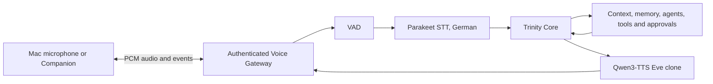

# Trinity Eve Voice Architecture

Trinity remains text-first. `TrinityConversationBackend` calls the same
`TrinityBrain` used by the existing interfaces, so voice keeps session context,
memory, agents, tools and policy checks. `DirectLLMConversationBackend` exists
only for diagnostics.

The optional runtime uses a pinned upstream process and does not vendor model
code or weights. Realtime mode is bound to an internal loopback port. Trinity's
proxy adds access-token enforcement before a remote client can reach it.

## Profiles

| Profile | Purpose | Device | Audio client |
|---|---|---|---|
| `eve-mac-local` | Mac microphone and speaker with barge-in | MLX/MPS | Local Mac |
| `eve-mac-server` | iPhone/iPad thin clients over Tailscale | MLX/MPS | Remote Apple device |
| `eve-windows-local` | Windows microphone and speaker with barge-in | CUDA | Local PC |
| `eve-windows-server` | iPhone/iPad thin clients over Tailscale | CUDA | Remote Apple device |
| `eve-windows-remote` | Windows control plane using an Ubuntu GPU host | Remote CUDA | Windows or Companion |
| `eve-linux-gpu-server` | Parakeet and Eve inference for a remote Windows core | CUDA | Remote desktop or Companion |
| `eve-trinity` | Auto-selected local Trinity path | Auto | Local desktop |
| `eve-direct-ornith` | Isolated half-duplex LLM diagnostics | MLX/MPS | Local desktop |

Local production profiles no longer use the upstream half-duplex audio
streamer. Trinity connects to the loopback Realtime endpoint with its own
full-duplex PCM client. Server VAD cancels the current LLM/TTS turn when new
speech begins, while the client immediately discards queued playback. Existing
v0.16.x `mode: local` settings for local Trinity profiles are migrated at load
time without changing the selected model or voice sample.

One Eve runtime currently serves one active realtime audio client. Select a
local profile for desktop microphone/speaker use, or the matching server
profile for iPhone/iPad use. Text, sessions and generated results continue to
sync through the normal Trinity Bridge independently of that audio choice.

## Upstream projects

- [Hugging Face speech-to-speech](https://github.com/huggingface/speech-to-speech),
  pinned to package version `0.2.11`, Apache-2.0. It supplies VAD, Parakeet,
  Qwen3-TTS orchestration and the OpenAI-Realtime-compatible server.
- [Blaizzy/mlx-audio](https://github.com/Blaizzy/mlx-audio), pinned to `0.4.2`
  on Apple Silicon, MIT license. It supplies the MLX audio model runtime.
- Models are referenced from Hugging Face and are never stored in this repository.
  Review each model card and license before redistribution.

Configuration details are in `core/config.json.example`; security boundaries are
documented in [VOICE_SECURITY.md](VOICE_SECURITY.md).
The split Ubuntu/Windows deployment is documented in
[VOICE_UBUNTU_HOST.md](VOICE_UBUNTU_HOST.md).
