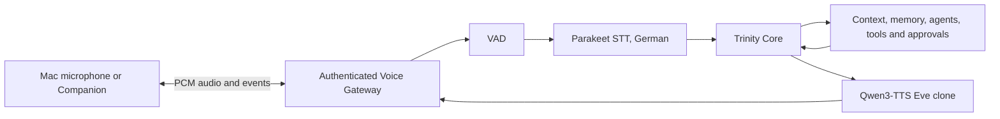

# Trinity Eve Voice Architecture

Trinity remains text-first. `TrinityConversationBackend` calls the same
`TrinityBrain` used by the existing interfaces, so voice keeps session context,
memory, agents, tools and policy checks. `DirectLLMConversationBackend` exists
only for diagnostics.

The optional runtime uses a pinned upstream process and does not vendor model
code or weights. Realtime mode is bound to an internal loopback port. Trinity's
proxy adds access-token enforcement before a remote client can reach it.

## Profiles

| Profile | Purpose | Device | Public by default |
|---|---|---|---|
| `eve-mac-local` | Mac microphone and speaker | MLX/MPS | No |
| `eve-mac-server` | iPhone/iPad thin clients | MLX/MPS | No |
| `eve-windows-server` | Windows/CUDA voice server | CUDA | No |
| `eve-trinity` | Auto-selected local Trinity path | Auto | No |
| `eve-direct-ornith` | Isolated LLM diagnostics | MLX/MPS | No |

## Upstream projects

- [Hugging Face speech-to-speech](https://github.com/huggingface/speech-to-speech),
  pinned to package version `0.2.11`, Apache-2.0. It supplies VAD, Parakeet,
  Qwen3-TTS orchestration and the OpenAI-Realtime-compatible server.
- [Blaizzy/mlx-audio](https://github.com/Blaizzy/mlx-audio), pinned to `0.4.2`
  on Apple Silicon, MIT license. It supplies the MLX audio model runtime.
- Models are referenced from Hugging Face and are never stored in this repository.
  Review each model card and license before redistribution.

Configuration details are in `core/config.json.example`; security boundaries are
documented in [VOICE_SECURITY.md](VOICE_SECURITY.md).
