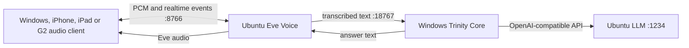

# Ubuntu NVIDIA host for Trinity Eve Voice

This layout keeps the GPU on Ubuntu and runs Trinity's control plane inside a
Windows VM. Ubuntu provides compute services only; Windows remains responsible
for sessions, memory, agents, tools, approvals and the user interface.



## 1. Prepare Ubuntu

Install the NVIDIA driver and verify CUDA visibility:

```bash
nvidia-smi
```

Clone Trinity into a local, non-synchronized directory, create its normal
Python environment, then install the optional voice runtime with an authorized
Eve reference sample:

```bash
cd ~/Trinity_Assistant
./scripts/install_voice_ubuntu.sh /secure/path/Eve_Schule.mp3
```

The sample is biometric/personal data. Keep it outside Git and cloud-synced
project folders.

## 2. Configure the Ubuntu voice server

In Ubuntu's local `core/config.json`, use:

```json
{
  "voice": {
    "engine": "eve",
    "profile": "eve-linux-gpu-server",
    "access_token": "VOICE_TOKEN",
    "remote_core_base_url": "http://WINDOWS_TAILSCALE_IP:18767/v1",
    "remote_core_api_key": "CORE_TOKEN"
  }
}
```

Validate and start it:

```bash
./venv/bin/trinity voice doctor --profile eve-linux-gpu-server
./venv/bin/trinity voice serve --profile eve-linux-gpu-server
```

The Voice Gateway listens on port `8766`. Allow access only from the private
LAN or Tailscale interface.

## 3. Configure Windows

Follow [VOICE_WINDOWS.md](VOICE_WINDOWS.md) and use profile
`eve-windows-remote`. Its Core token must match `CORE_TOKEN`; its Voice token
must match `VOICE_TOKEN`.

## 4. Verify the complete path

1. `trinity voice doctor --profile eve-linux-gpu-server` succeeds on Ubuntu.
2. `trinity voice doctor --profile eve-windows-remote` succeeds on Windows.
3. A typed Windows chat request returns normally through Trinity Core.
4. A Windows/iPhone/iPad microphone request reaches Ubuntu STT, appears in the
   same Trinity session, and returns as Eve audio on the selected speaker.
5. Disabling Ubuntu leaves the Windows UI usable; selecting Legacy restores the
   previous Windows STT/TTS path.

GPU passthrough is intentionally not used. It would usually remove the GPU from
the Ubuntu host and adds VM/driver fragility without improving this networked
speech pipeline.
