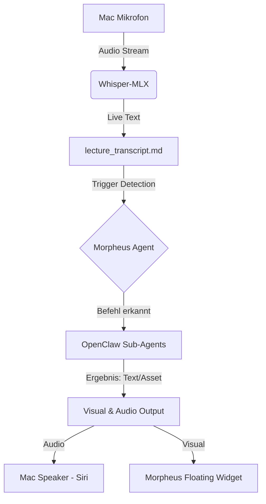

# 🧞‍♂️ Projekt: Morpheus Assistant

> **Status:** Initialisierungsphase
> **Ziel:** Ein KI-gestützter Lehr-Assistent für den Mac, der ambient mithört, via OpenClaw agiert und als schwebendes HTML-Widget visualisiert wird.

---

## 🛠️ Tech-Stack

| Komponente | Technologie | Zweck |
| :--- | :--- | :--- |
| **"Ears" (Audio)** | `whisper-mlx` | Lokale, ressourcenschonende Transkription auf dem M5 (Apple Silicon). |
| **"Brain" (Logic)** | `OpenClaw` | Orchestrierung von Primär- und Subagenten (Tools, Recherche). |
| **"Voice" (Output)** | `nsspeechsynthesizer` | Native Mac-TTS (Siri) für latenzfreies Feedback. |
| **"Avatar" (UI)** | `PySide6` + `QtWebEngine` | Schwebendes, rahmenloses HTML5/CSS3-Widget (Morpheus). |
| **Storage** | `Markdown/JSON` | Laufendes Transkript und Session-Kontext. |

---

## 📐 Architektur

---

## 🎨 Design-Vorgaben (Morpheus UI)

1.  **Vibe:** Mystisch, modern, minimalistisch.
2.  **Zustände:**
    *   **Idle:** Ein sanft pulsierender, rauchartiger Partikel-Effekt (Morpheus schläft).
    *   **Listening:** Partikel bewegen sich schneller, reagieren auf Lautstärke.
    *   **Thinking:** Der Avatar wirbelt oder verändert die Farbe (z.B. von Blau zu Gold).
    *   **Reporting:** Widget klappt aus zu einer Glasmorphismus-Karte mit HTML-Content.

---

## 📅 Phasenplan

### Phase 1: Der "Körper" (UI/UX)
- [ ] Erstellung des rahmenlosen PySide6 Fensters.
- [ ] Implementierung des HTML/CSS Avatars (Morpheus).
- [ ] "Always on Top" Logik & Drag-and-Drop Positionierung.

### Phase 2: Die "Ohren" (Audio-Stack)
- [ ] Integration von Whisper-MLX.
- [ ] Real-time File-Watcher für das Transkript.
- [ ] Trigger-Wort Erkennung (Keywords: "Morpheus", "recherchieren").

### Phase 3: Der "Geist" (Agent-Integration)
- [ ] Anbindung an das OpenClaw Framework.
- [ ] Mapping von Intents auf Subagenten (Web, Charts, Bilder).
- [ ] Siri-TTS Integration.

### Phase 4: Politur & Assets
- [ ] Finetuning der Animationen.
- [ ] Dashboard-Ansicht für HTML-Ergebnisse.
- [ ] Performance-Audit auf dem M5.
